# NEAT Installation & Setup Guide

Scope: concise, practical steps to install, pair, and run Palette Neat (Host + Modalix DevKit).

Primary reference: https://developer.sima.ai/software/getting-started/

---

**Quick checklist**

- Confirm your Modalix board software: `cat /etc/buildinfo`
- **First-time setup:** complete Steps 1–3 and 5 (Step 4, Model Compiler, is optional).
- **Second and later runs:** run `sima-cli sdk setup --devkit <devkit-ip>` again, but at setup prompt 6 press `n` so setup reuses the existing SDK container instead of creating a new one.
- After setup completes, continue with Step 5 to attach VS Code to the SDK container and open `/workspace`.
- Use a supported host (Ubuntu 22.04/24.04, Windows+WSL, macOS with Colima)
- Install `sima-cli`, container runtime (Docker/Colima), then the NEAT SDK matching your board
- Use `dk` from inside the SDK to run binaries and PyNeat scripts on the board

---

### Component Overview

- **Host:** Development machine with `sima-cli`, container runtime, and local workspace.
- **Modalix DevKit (Board):** Target hardware running Modalix firmware where applications execute.
- **NEAT SDK (cross-compile):** Containerized environment for building C++ apps, preparing model artifacts, and pairing with the board.
- **Neat Core:** Runtime C++ libraries that power model execution and app APIs on Modalix.
- **PyNeat:** Python bindings/runtime for prototyping and running NEAT apps on the DevKit.
- **Model Compiler:** Optional toolchain to compile/quantize ONNX or GenAI models for Modalix.
- **NEAT Insight:** Browser-based inspection and debugging tool for runtime streams, files, and logs. See [neat_insight.md](neat_insight.md).
- **NEAT Apps:** User applications built with NEAT C++ or PyNeat deployed to the DevKit.


---

## 1. Host prerequisites

- Host OS: Ubuntu 22.04/24.04 (recommended), Windows 11 (WSL2), macOS (Colima/Apple Silicon supported inside SDK)
- Tools: `sudo` access, Git, `curl`/`wget`, a container runtime (Docker or Colima), and sufficient disk space (~10+ GB)
- Install `sima-cli` (example):

```bash
# download and install sima-cli (verify latest instructions on the official site)
curl -fsSL https://artifacts.neat.sima.ai/sima-cli/linux-mac.sh | bash
```
---

## 2. Install the NEAT SDK on HOST (Cross-Compiler)

Do this once during first-time setup. On second and later runs, skip this step unless you intentionally want to install a different SDK version or a latest SDK image.

1. Choose the SDK image that matches your board version. Example for recent releases:

```bash
# recommended current image tag
sima-cli install ghcr:sima-neat/sdk:v2.1-latest

# sse sdk:v2.0.0 if your board is 2.0.0
sima-cli install ghcr:sima-neat/sdk:v2.0.0
```

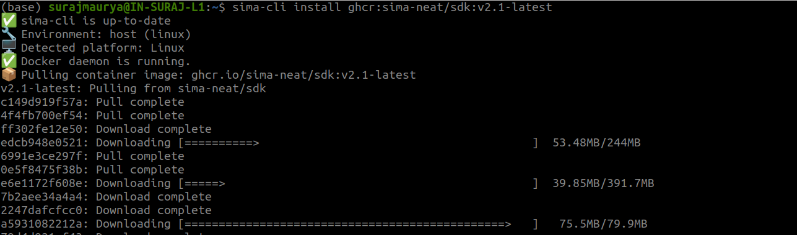

Reference:

- https://developer.sima.ai/software/getting-started/dev-environment/install-the-environment#install

- https://developer.sima.ai/software/getting-started/compatibility/

---

## 3. Pair with the Modalix DevKit (recommended setup)


---

**Before starting, make sure the host machine and Modalix DevKit can reach each other on the network. You should be able to ping the DevKit IP from the host.**

- Run the guided pairing/setup command. This installs the matching runtime components and configures the shared `/workspace`.
- The setup flow may ask whether to install the Model Compiler. Install it only if you plan to compile or quantize models locally.
- The screenshots below walk through each setup prompt. The SDK/container image name may be different on your machine.

**Repeat-run shortcut:** *For the second and later runs, use the same setup command below, but when you reach setup prompt 6, press `n`. After setup completes, continue to Step 5 and attach VS Code to the running SDK container.*

--- 

**NOTE-**
```
If you do not have the DevKit IP address yet, run setup without the `--devkit` option:    
    - sima-cli sdk setup
    - And then install the NEAT library separately on Modalix devkit, using this guide - https://developer.sima.ai/software/getting-started/neat-library/install-or-update
```

---

If you know the DevKit IP address, run:

```bash
sima-cli sdk setup --devkit <devkit-ip>
```

1. Run the setup command. `sima-cli sdk setup --devkit XX.XX.XX.XX`


    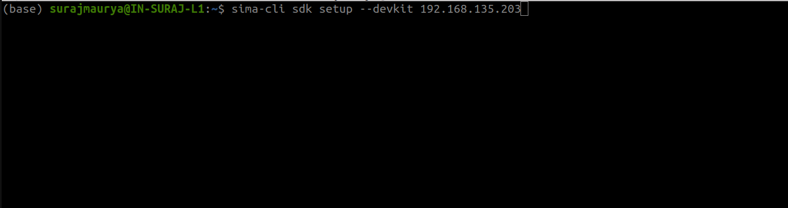
    
    ---

2. System check: press `Y`.


    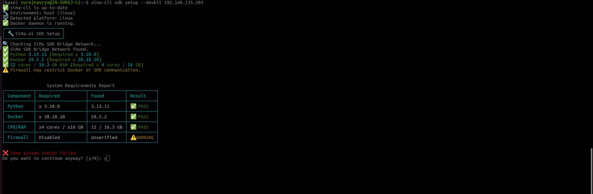

    ---


3. Select the Docker image that you downloaded in Step 2.


    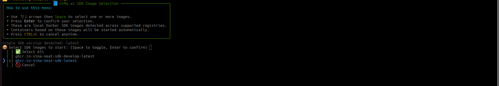

    ---

4. Select the default workspace, or enter a custom workspace path.


    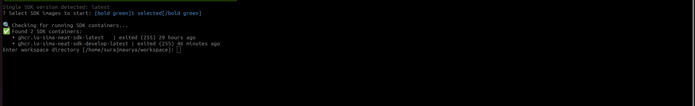

    ---

5. SDK extension: press `Enter`.


    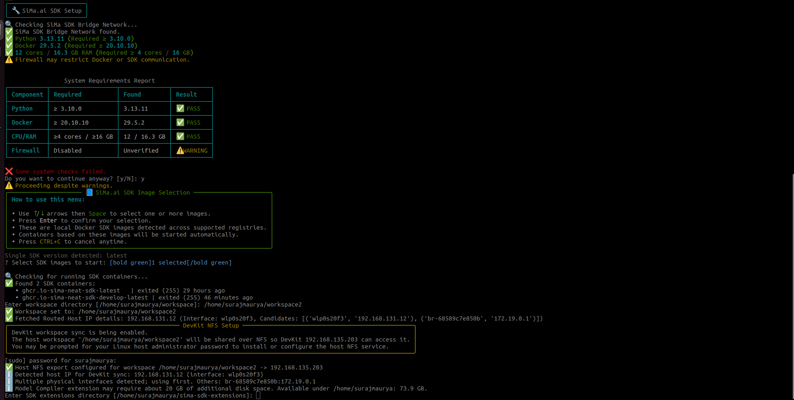

    ---

6. **Important for second and later runs:** press `n`. This reuses the existing SDK container. 

    If you press `y`, setup may create a new container and run the installation again.

    For first-time installation only, follow the prompt as needed to create the SDK container.


    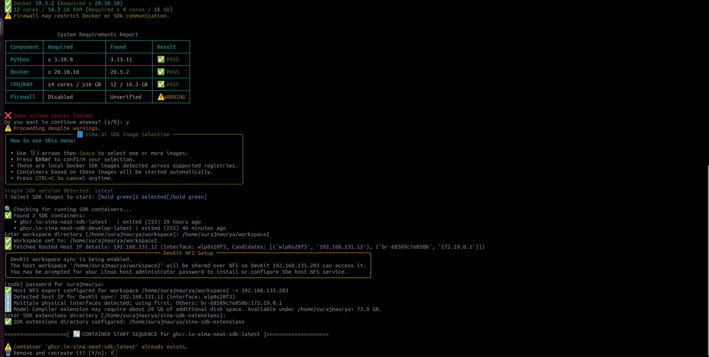

    ---

7. Install the Model Compiler extension only if needed. This is optional and may take about 15 minutes and around 10 GB of disk space.


    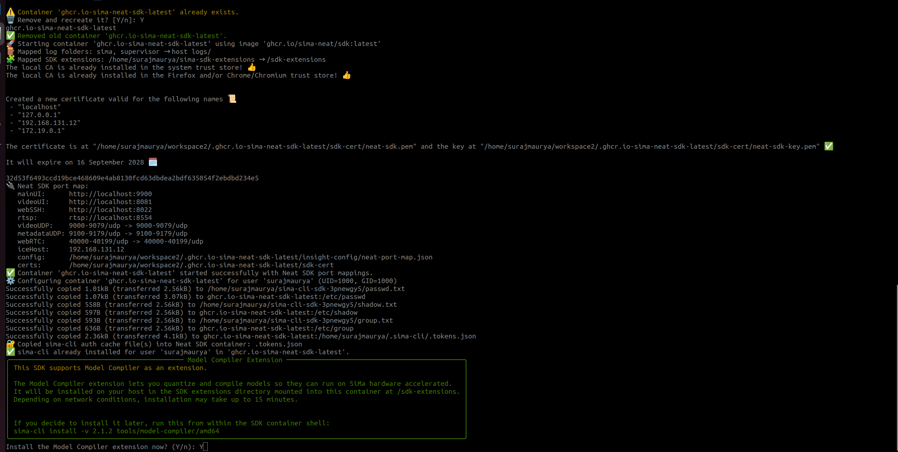

    ---

8. Select the workspace path for the Modalix DevKit. 

    By default, setup uses `/workspace` on the board and mounts the host workspace folder there.

    Press `Enter` to select default location. If it asks for a password, enter  `edgeai`.


    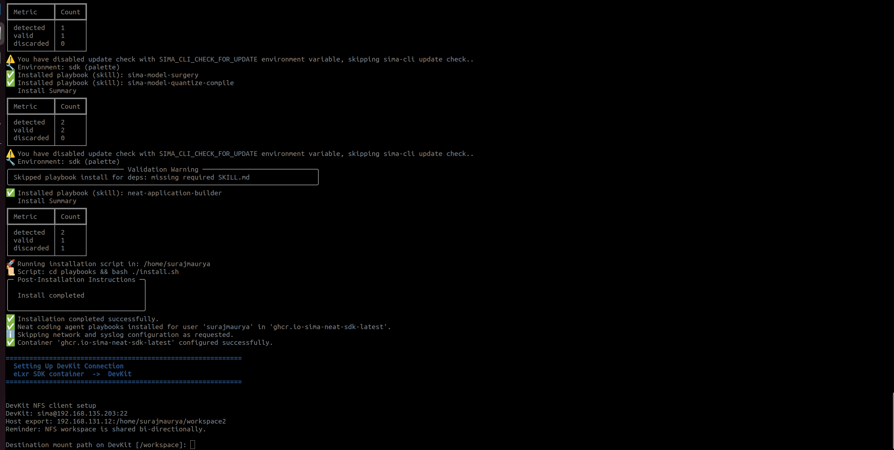

    ---

9. Confirm that the installation completed successfully.


    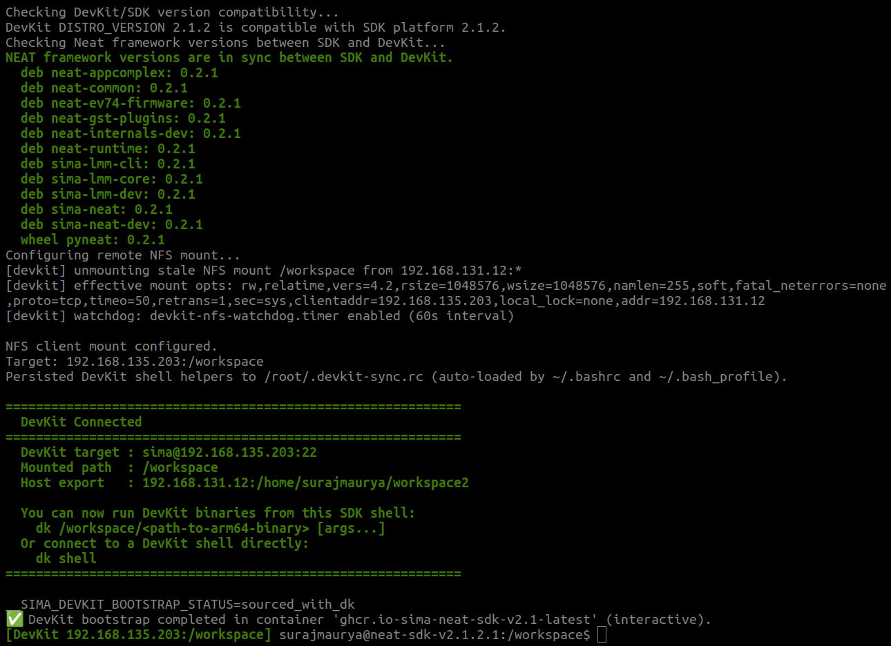

    ---
Reference: https://developer.sima.ai/software/getting-started/dev-environment/pair-with-a-devkit/

---

## 4. (Optional) Install the Model Compiler

Install only if you need to compile ONNX/GenAI models for Modalix. Choose the correct architecture (amd64/arm64) and version that matches your board/SDK.

Example:

```bash
# amd64 example for v2.1.2
sima-cli install -v 2.1.2 tools/model-compiler/amd64
activate-model-compiler
```

Reference: https://developer.sima.ai/software/compile-a-model/

---

## 5. Open the SDK container in VS Code, then build and run

1. Install VS Code on the host machine:

   - Download: https://code.visualstudio.com/download
   - Ubuntu example:

    ```bash
    sudo apt update
    sudo snap install code --classic
    ```

2. Open VS Code and install these extensions:
   - **Dev Containers** by Microsoft

3. Attach VS Code to the running NEAT SDK container:

    - Open the VS Code Command Palette with `Ctrl+Shift+P`.
    - Select **Dev Containers: Attach to Running Container...**.

        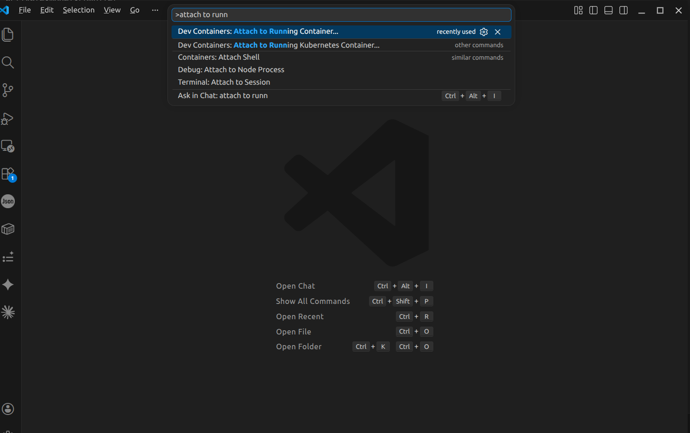

    - Select the downloaded and installed `sima-neat/sdk` container.

        

    - In the attached VS Code window, open the `/workspace` or `/workspace/demo-neat` folder.

        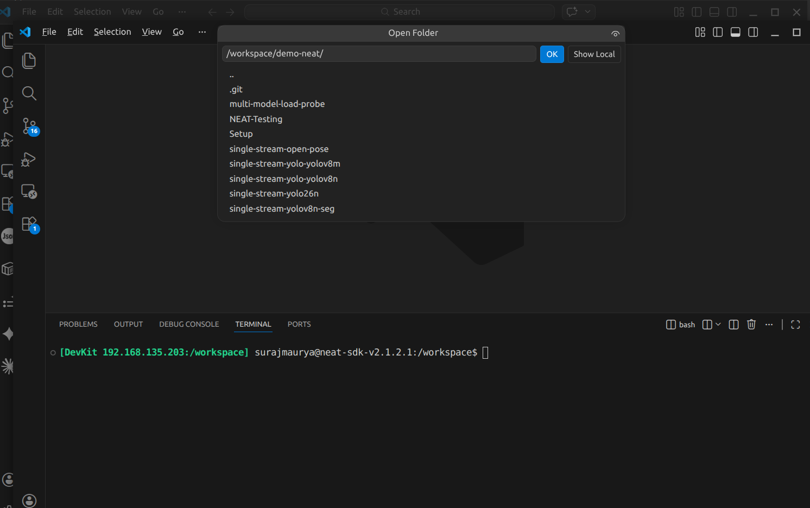

    - Install `Codex` or `Claude` VS Code extension for Agentic Mode of  Development. 

        

    - Check if sima-skill get picked by `Codex` / `Claude`.

        

    - Check if sima-skill get picked by `Codex` / `Claude`.

        

    - Check if sima-skill get picked by `Codex` / `Claude`.

        

    - Done with the setup

4. From inside the attached SDK container, build your C++ app or prepare a PyNeat script in `/workspace`.

5. Use `dk` to execute on the paired DevKit:

```bash
# run a compiled C++ binary on devkit
dk build/<binary-name>

# run a PyNeat script on devkit
dk hello_neat.py
```

6. Minimal PyNeat smoke test (`hello_neat.py`):

```python
import neat
print("PyNeat import successful")
```

Run inside the SDK using `dk hello_neat.py` to confirm runtime availability on the Modalix DevKit.

Reference: https://developer.sima.ai/software/develop-apps/hello-neat/minimal/

---

## 6. Troubleshooting & tips

- If versions mismatch: confirm board with `cat /etc/buildinfo` and pin the SDK/model-compiler versions accordingly.
- Use the shared `/workspace` (set by pairing) to avoid manual file copies between host and DevKit.
- NEAT Insight: available at `https://localhost:9900` when running inside the SDK — use it to inspect streams, files, and runtime logs. See [neat_insight.md](neat_insight.md).
- For network pairing issues, ensure the DevKit and host are reachable on the same network and firewall rules allow the pairing flow.
- Primary reference: https://developer.sima.ai/software/getting-started/

---

## References

- https://developer.sima.ai/software/getting-started/
- https://developer.sima.ai/software/getting-started/dev-environment/
- https://developer.sima.ai/software/compile-a-model/
- NEAT Insight guide: [neat_insight.md](neat_insight.md)
