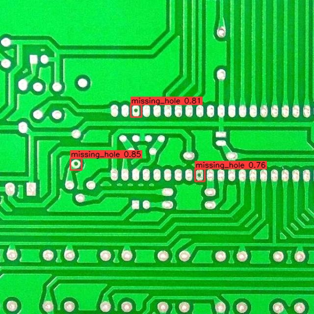
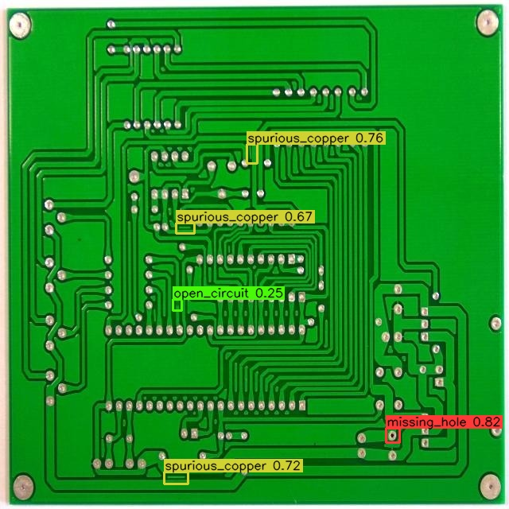

# PCB Defect Detection - YOLO26n

## Introduction

This app runs a folder of PCB images through a custom YOLO26n defect-detection model on the
Modalix DevKit. It draws class-colored boxes on each image and writes annotated JPGs to
`./output`.

The model detects six PCB manufacturing defects:

```text
missing_hole, mouse_bite, open_circuit, short, spur, spurious_copper
```

Dataset and Model (pt/onnx) reference: [PCB defects detection](https://platform.ultralytics.com/muhammadrizwanmunawar/datasets/pcb-defects-detection).



## Project Files

- App entry point: `./main.py`
- Runtime config: `./config/default.conf`
- Input images: `./images`
- Output images: `./output`
- BF16 compiled model pack: `./assets/models/latest_plc_yolo26n_mpk.tar.gz`

Run all commands below from this app folder:

```bash
cd /path/to/demo-neat/apps/pcb-defect-detection-yolo26n
```

## Requirements

Run from the SiMa SDK shell where `sima-cli` and `dk` are available, and where `/workspace` is
shared with the DevKit.

The precompiled BF16 model pack is required before running:

```text
./assets/models/latest_plc_yolo26n_mpk.tar.gz
```

## Model Download

The model is custom-trained, so it is not in the SiMa Model Zoo. Download the BF16 model pack into
`./assets/models`:

```bash
mkdir -p ./assets/models
# Download the BF16 latest_plc_yolo26n_mpk.tar.gz into ./assets/models
# https://drive.google.com/drive/folders/13AcEIWG3mBlTmEgNa1IjWlOL_leyjni5?usp=sharing
```

Only `latest_plc_yolo26n_mpk.tar.gz` is needed to run inference. The `.pt` and `.onnx`
files are only needed if you want to rebuild the BF16 model pack.

## Configure

Default runtime settings are in `./config/default.conf`:

```text
model=./assets/models/latest_plc_yolo26n_mpk.tar.gz
input_dir=./images
output_dir=./output
output_suffix=_detected
infer_size=640
score=0.25
nms=0.45
top_k=300
timeout_ms=8000
labels=missing_hole,mouse_bite,open_circuit,short,spur,spurious_copper
```

CLI flags override config values.

## How To Run

Run with the default config:

```bash
dk ./main.py \
  --config ./config/default.conf
```

Run with stricter thresholds:

```bash
dk ./main.py \
  --config ./config/default.conf \
  --score 0.30 --nms 0.50
```

After the run, annotated images are written to:

```text
./output/<image-name>_detected.jpg
```



## Compile Model Pack

Use this section only if you want to rebuild the BF16
`./assets/models/latest_plc_yolo26n_mpk.tar.gz` from the trained ONNX artifact.

Expected compile input:

```text
./assets/models/yolo26n.onnx
```

Activate the model compiler environment from the Neat SDK host system:

```bash
source /sdk-extensions/model-compiler/bin/activate
```

Run graph surgery to expose raw YOLO heads and convert C2PSA attention to BF16-friendly
Einsum nodes:

```bash
python ./compile/surgery_einsum_attention.py \
  --model_path ./assets/models/yolo26n.onnx \
  --out ./assets/models/yolo26n_einsum_raw.onnx
```

Compile the prepared ONNX with BF16 quantization and MLA tessellation:

```bash
python ./compile/compile_yolo26_modelsdk.py \
  --model ./assets/models/yolo26n_einsum_raw.onnx \
  --build-dir ./compile/build/latest_yolo26n_compile \
  --strict-one-mla \
  --json-output ./compile/latest_compile_report.json
```

Copy the generated pack to the runtime model path:

```bash
cp -f $(find ./compile/build/latest_yolo26n_compile -name '*_mpk.tar.gz' | head -n1) \
  ./assets/models/latest_plc_yolo26n_mpk.tar.gz
```

The final pack is:

```text
./assets/models/latest_plc_yolo26n_mpk.tar.gz
```
