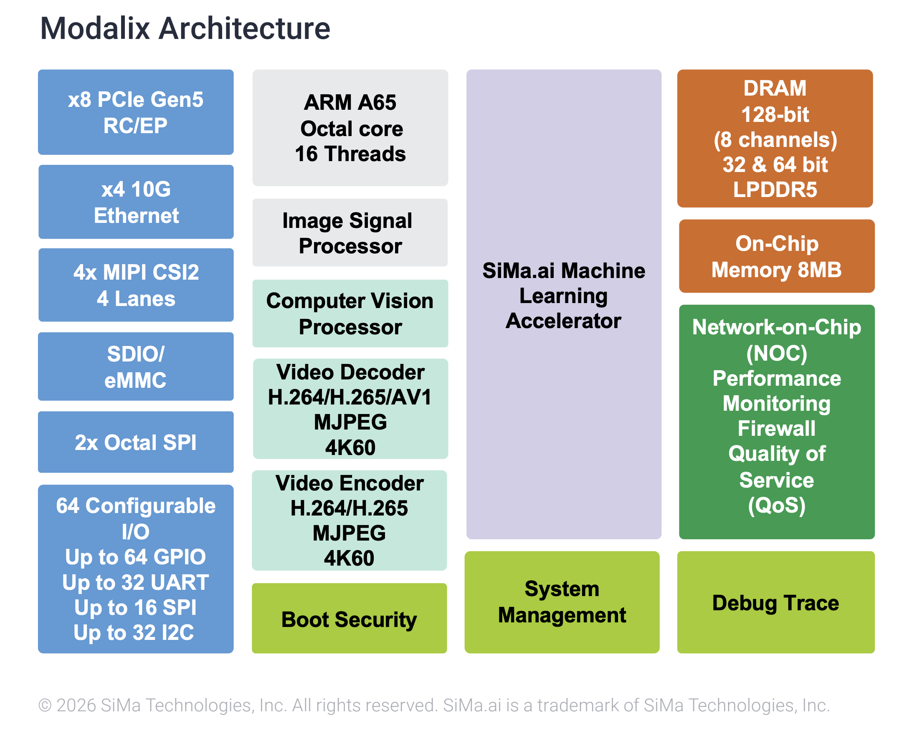
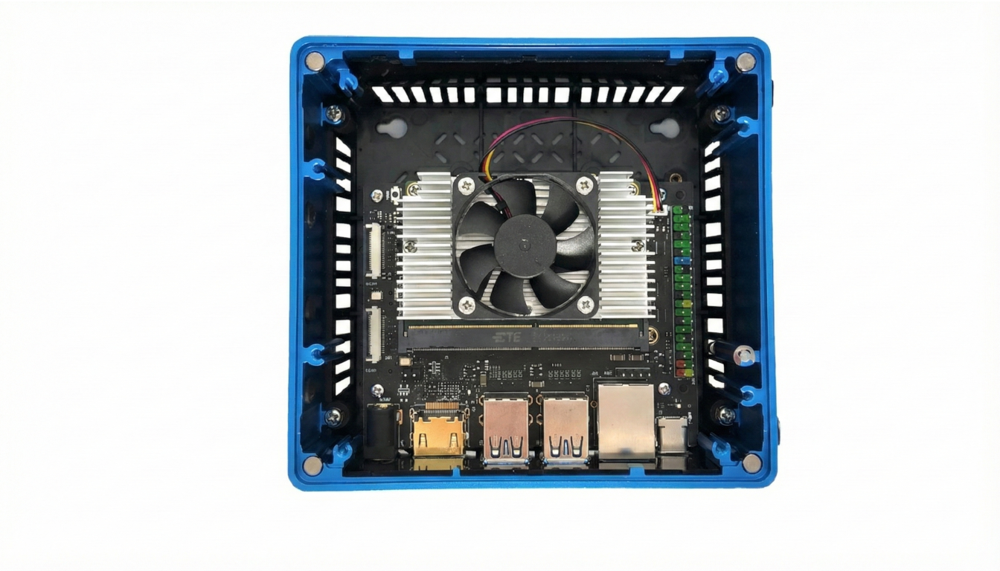

# Chapter 1 — Know the hardware

*What the MLSoC contains, and why its shape determines how you write code for it.*

---

## About the MLSoC Modalix

The MLSoC Modalix is SiMa.ai's second-generation machine-learning system-on-chip. It combines an
Arm Cortex-A65 application complex, a high-throughput Machine Learning Accelerator (MLA), an Image
Signal Processor (ISP) for camera ingest, and a Computer Vision Unit (CVU) for classical vision
workloads — all on a single die.

This integration lets you run multimodal, generative, and vision AI pipelines at the edge without
combining separate accelerators, host CPUs, and camera bridges. The Modalix SoM packages MLSoC
Modalix for carrier-board and product integration, and every DevKit documented here uses the same
silicon.

<p align="center">
  
</p>

---

## The blocks

| Block | What it is | Specification |
|---|---|---|
| **MLA** | Machine Learning Accelerator — runs your compiled model | 50 TOPS  |
| **CPU** | Arm application complex — runs Linux and your application logic | 8 × Cortex-A65 @ 1.4 GHz |
| **ISP** | Image Signal Processor — raw camera sensor ingest | Arm Mali-C71 @ 1.2 GHz |
| **CVU** | Computer Vision Unit — pre/post-processing, resize, colour convert | Synopsys ARC EV74, 4-core, 750 16-bit GOPS |
| **Codecs** | Hardware video encode and decode | H.264 / H.265 4Kp60 enc+dec · AV1 4Kp60 dec · MJPEG 4Kp30 enc, 4Kp60 dec |
| **Memory** | Shared LPDDR5 | 32 GB, 128-bit (8 channels) |
| **NoC** | Network-on-Chip — the interconnect all of the above share | — |

---

## Storage, and why it matters immediately

| | Size | Mounted at | Use it for |
|---|---|---|---|
| **eMMC** | 16 GB | `/` | The OS  |
| **NVMe** | 500 GB (M.2) | `/media/nvme` *(you mount it)* | Everything you create |


---

## Why the architecture shapes your code

The Neat Library builds a **graph** across these blocks. When you write an application, you are
describing a path through the chip:

```text
camera → ISP → CVU (resize, colour) → MLA (inference) → codec (H.264) → network
```

Each hop stays in device memory. The CPU sets the graph up and then mostly gets out of the way.

The practical consequence:

- **Work that stays on-chip is nearly free; work that drags data back to the CPU is not.** A
  host-side colour conversion or a CPU JPEG decode can cost several times more CPU than the
  inference itself.

---

## Power and thermals

Typical draw is **8–12 W** depending on workload. The enclosure contains a heatsink and an active
cooling fan.
[Chapter 11](11-install-simaai-sentinel.md) installs the tool that shows temperature, power and MLA
utilisation live.



---

## Where the numbers come from

- [SiMa hardware overview](https://developer.sima.ai/hardware)
- [SOM Carrier Board Data Sheet (PDF)](https://docs.sima.ai/pkg_downloads/datasheets_product_briefs/SiMa_SOM_Carrier_Board_Data_Sheet_Rev1.2_1-24-2026.pdf) — pinouts and electrical detail

---

| ← Previous | Contents | Next → |
|:---|:---:|---:|
| [Contents](README.md) | [All chapters](README.md) | [Chapter 2 · The board and its connections](02-board-and-connections.md) |
