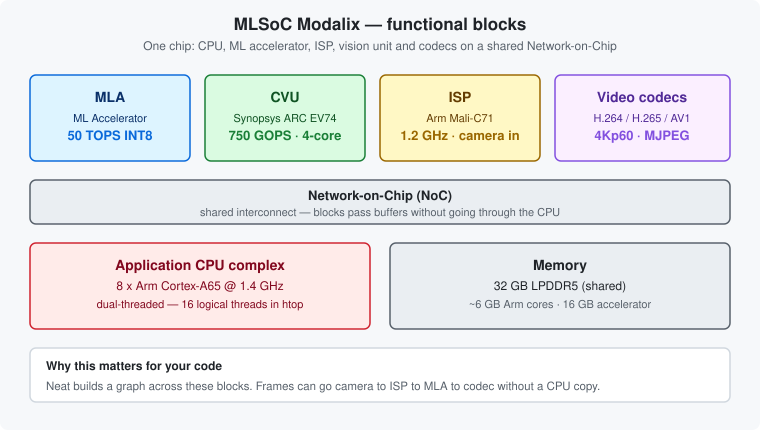

# Chapter 1 — Know the hardware

*What the MLSoC contains, and why its shape determines how you write code for it.*

---

## The one-paragraph version

Modalix is a single chip that puts a general-purpose CPU, a machine-learning accelerator, an image
signal processor, a computer-vision unit and video codecs on one shared interconnect. That last part
is the point: a camera frame can travel from the ISP through the accelerator to the video encoder
**without the CPU ever touching it**. Understanding that is the difference between an application
that hits full frame rate and one that doesn't.



---

## The blocks

| Block | What it is | Specification |
|---|---|---|
| **MLA** | Machine Learning Accelerator — runs your compiled model | 50 TOPS INT8 |
| **CPU** | Arm application complex — runs Linux and your application logic | 8 × Cortex-A65 @ 1.4 GHz |
| **ISP** | Image Signal Processor — raw camera sensor ingest | Arm Mali-C71 @ 1.2 GHz |
| **CVU** | Computer Vision Unit — pre/post-processing, resize, colour convert | Synopsys ARC EV74, 4-core, 750 16-bit GOPS |
| **Codecs** | Hardware video encode and decode | H.264 / H.265 4Kp60 enc+dec · AV1 4Kp60 dec · MJPEG 4Kp30 enc, 4Kp60 dec |
| **Memory** | Shared LPDDR5 | 32 GB (≈6 GB for the Arm cores, 16 GB for the accelerator) |
| **NoC** | Network-on-Chip — the interconnect all of the above share | — |

### A detail that confuses people

The CPU cores are **dual-threaded**. Eight physical Cortex-A65 cores present as **16 logical
threads**, so `htop` shows sixteen bars. Nothing is wrong.

---

## Storage, and why it matters immediately

| | Size | Mounted at | Use it for |
|---|---|---|---|
| **eMMC** | 16 GB | `/` | The OS. Roughly 1–2 GB free. |
| **NVMe** | 500 GB (M.2) | `/media/nvme` *(you mount it)* | Everything you create |

The root filesystem is small enough that a couple of model archives will fill it. A full root
filesystem on this board produces confusing, unrelated-looking failures — installs that die
halfway, logs that stop, services that misbehave. [Chapter 9](09-mount-nvme.md) deals with this,
and it is not optional in practice.

---

## Why the architecture shapes your code

The Neat Library builds a **graph** across these blocks. When you write an application, you are
describing a path through the chip:

```text
camera → ISP → CVU (resize, colour) → MLA (inference) → codec (H.264) → network
```

Each hop stays in device memory. The CPU sets the graph up and then mostly gets out of the way.

Two practical consequences:

- **Work that stays on-chip is nearly free; work that drags data back to the CPU is not.** A
  host-side colour conversion or a CPU JPEG decode can cost several times more CPU than the
  inference itself.
- **The accelerator's memory is separate from the CPU's.** The ~6 GB / 16 GB split above is why a
  large model can load while your Python process still looks small.

You do not need to think about any of this to run the examples. You will need it the first time
something is slower than you expected.

---

## Power and thermals

Typical draw is **8–12 W** depending on workload. The enclosure contains a heatsink and an active
cooling fan, and the board throttles rather than failing if it gets hot — so a workload that slowly
loses throughput over several minutes is usually thermal, not a bug in your code.
[Chapter 11](11-install-simaai-sentinel.md) installs the tool that shows temperature, power and MLA
utilisation live.


---

## Where the numbers come from

- [SiMa hardware overview](https://developer.sima.ai/hardware)
- [SOM Carrier Board Data Sheet (PDF)](https://docs.sima.ai/pkg_downloads/datasheets_product_briefs/SiMa_SOM_Carrier_Board_Data_Sheet_Rev1.2_1-24-2026.pdf) — pinouts and electrical detail

---

| ← Previous | Contents | Next → |
|:---|:---:|---:|
| [Contents](README.md) | [All chapters](README.md) | [Chapter 2 · The board and its connections](02-board-and-connections.md) |
