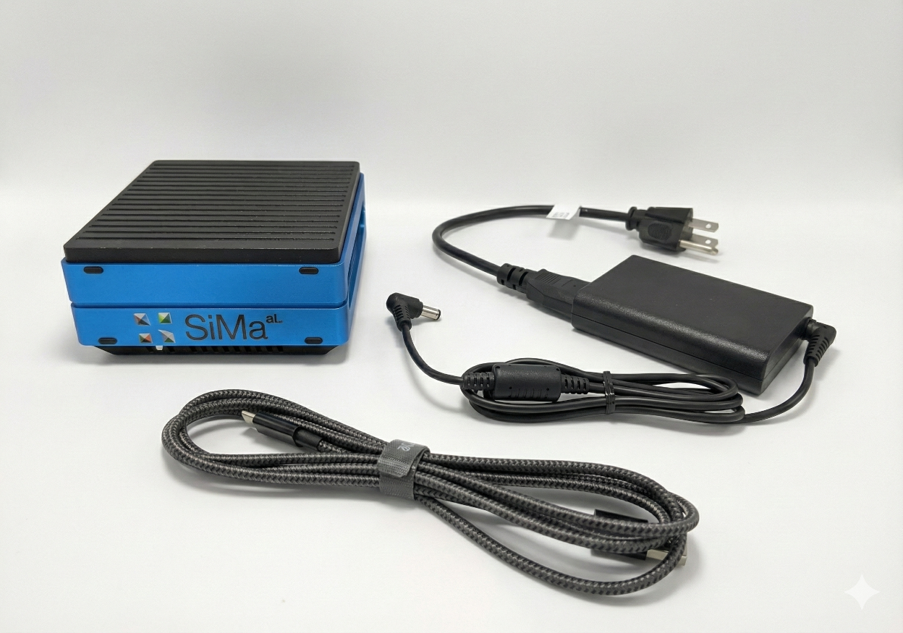
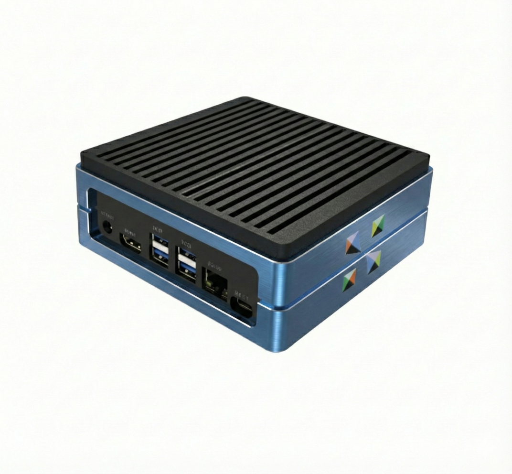
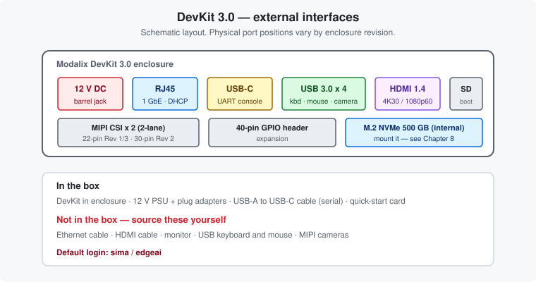

# Chapter 2 — The board and its connections

*Every port on the outside, what ships in the box, and what you have to buy yourself.*

---

## What's in the box

- Modalix SOM mounted on the SOM carrier board, in its enclosure
- 12 V power supply with regional plug adapters
- USB-A → USB-C cable, for the serial console
- Quick-start card

### Not included — get these before you start

| Item | Needed for |
|---|---|
| **Ethernet cable (RJ45)** | Chapters 4, 5 and 6. Nothing works without network access. |
| HDMI cable + monitor | [Chapter 3](03-hdmi-and-peripherals.md), optional |
| USB keyboard and mouse | [Chapter 3](03-hdmi-and-peripherals.md), optional |
| MIPI CSI cameras | Camera applications only |

The Ethernet cable is the one that catches people out. It is not in the box and you cannot install
anything without it.

---

## The ports

The same interfaces, laid out schematically:

| Interface | Detail |
|---|---|
| **12 V DC** | Barrel jack. A red LED lights when the board has power. |
| **Ethernet (RJ45)** | 1 GbE, DHCP by default. Used by every networking option in this guide. |
| **USB-C (UART)** | Serial console. Connects to a USB-A port on your host. Your fallback when the network is down. |
| **USB 3.0 × 4** | Keyboard, mouse, storage, USB cameras. |
| **HDMI 1.4** | 4K @ 30 Hz, or 1080p @ 60 Hz. Driven by a Silicon Motion SM768 controller. |
| **MIPI CSI × 2** | Two 2-lane camera inputs. 22-pin on Rev 1 and Rev 3, **30-pin on Rev 2** — check yours before ordering a ribbon. |
| **microSD** | Alternate boot media. |
| **40-pin GPIO** | Expansion header. |

Internally there is an **M.2 slot with a 500 GB NVMe drive** — see [Chapter 9](09-mount-nvme.md).

---

## Power on

1. Connect the 12 V supply to the barrel jack.
2. Connect the Ethernet cable — to your router ([Chapter 6](06-connect-to-router.md)) or directly to
   your host ([Chapter 5](05-internet-sharing.md)).
3. The red power LED lights and the board boots.

The rear panel also carries **START** and **RESET** buttons, visible in the photo above next to the
DC input. First boot takes a little longer than later ones.

**Default credentials:** `sima` / `edgeai`

---

## The serial console — your safety net

Everything else in this guide depends on the network. The serial console does not, which makes it
what you fall back on when the network is misconfigured, the IP is unknown, or an update went
sideways.

Connect the supplied **USB-A → USB-C** cable from your host to the DevKit's UART port. Setting it up
takes two minutes and is worth doing before you need it — **[Chapter 4](04-serial-console.md)**
covers Linux, macOS, Windows and the browser-based console.

---

## What to do next

| You want to | Go to |
|---|---|
| Use it as a desktop machine with a monitor | [Chapter 3](03-hdmi-and-peripherals.md) |
| Set up the serial console — **do this early** | [Chapter 4](04-serial-console.md) |
| Get it on the network — **do this one** | Chapters [5](05-internet-sharing.md), [6](06-connect-to-router.md) or [7](07-static-connection.md) |

---

| ← Previous | Contents | Next → |
|:---|:---:|---:|
| [Chapter 1 · Know the hardware](01-know-the-hardware.md) | [All chapters](README.md) | [Chapter 3 · HDMI, keyboard and mouse](03-hdmi-and-peripherals.md) |
