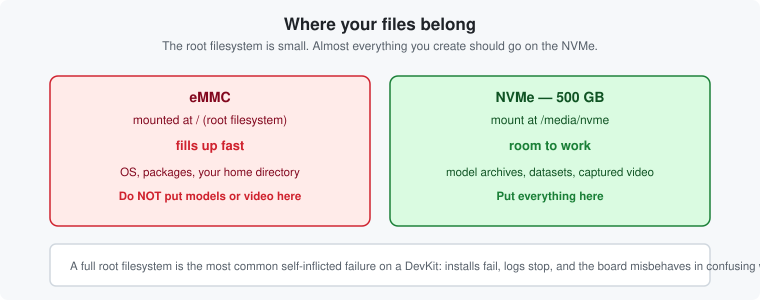

# Chapter 9 — Mount the NVMe

*Give yourself somewhere to put things. In practice this is not optional.*

---

## Why this matters more than it sounds

The root filesystem lives on a 16 GB eMMC with roughly **1–2 GB free**. A couple of model archives
will fill it. And a full root filesystem on this board does not fail cleanly — you get installs that
die halfway, logs that stop being written, and services misbehaving in ways that look unrelated to
disk space.

The board has a **500 GB NVMe** for exactly this. Mount it before you download anything.




---

## Is it already mounted?

On the board:

```bash
sima@modalix:~$ df -h
```

You want a line like:

```text
Filesystem      Size  Used Avail Use% Mounted on
/dev/nvme0n1p1  458G  1.2G  434G   1% /media/nvme
```

Narrow it down:

```bash
sima@modalix:~$ df -h | grep nvme      # mounted, and how full?
sima@modalix:~$ lsblk | grep nvme      # is the device even present?
sima@modalix:~$ mount | grep nvme      # mounted with what options?
```

If `lsblk` shows nothing, the drive is not detected at all — that is hardware, not configuration.
See [Troubleshooting](troubleshooting.md#df--h-shows-no-nvme).

---

## Mounting it

### Try this first — non-destructive

```bash
sima@modalix:~$ sima-cli nvme remount
```

This mounts an existing partition. Nothing is erased.

### Only if that fails — destructive

```bash
sima@modalix:~$ sima-cli nvme format
```

> **This erases everything on the NVMe.** Use it only when the drive is new, unpartitioned, or its
> filesystem is damaged. Never reach for it first.

Both commands mount at `/media/nvme` **and add an entry to `/etc/fstab`**, so the drive comes back
automatically on every boot. You do not re-run them after a reboot.

Confirm the persistent entry exists:

```bash
sima@modalix:~$ grep nvme /etc/fstab
```

---

## Verify

```bash
sima@modalix:~$ df -h /media/nvme
sima@modalix:~$ touch /media/nvme/.write-test && rm /media/nvme/.write-test && echo "NVMe is writable"
```

Then prove the fstab entry actually took, by rebooting:

```bash
sima@modalix:~$ sudo reboot
# reconnect, then:
sima@modalix:~$ df -h | grep nvme
```

Worth doing once. A drive that mounts now but not after reboot is a problem you want to find today,
not in the middle of something else.

---

## Where to put things

```text
/media/nvme/
├── llima/models/     # GenAI model directories (llima pull default)
├── models/           # compiled model archives
└── <your-app>/       # application data, outputs, captures
```

The rule is simple: **if you created it, it goes on the NVMe.** The eMMC is for the OS.

---

## Replacing the drive

A larger compatible M.2 NVMe module works. After fitting it:

```bash
sima@modalix:~$ sima-cli nvme format
```

---

| ← Previous | Contents | Next → |
|:---|:---:|---:|
| [Chapter 8 · Install sima-cli](08-install-sima-cli.md) | [All chapters](README.md) | [Chapter 10 · Check and update the board image](10-check-and-update-image.md) |
