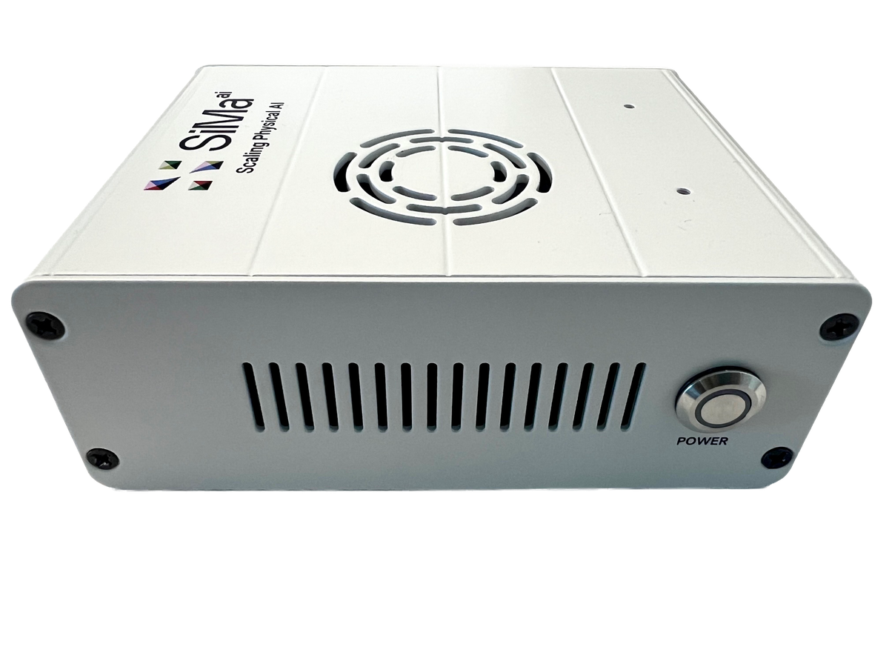

# Modalix DevKit — Quick Start Guide

A chapter-by-chapter walkthrough that takes a Modalix DevKit 3.0 from a sealed box to running
object detection and a local LLM.

  

Work through it in order the first time. After that, each chapter stands on its own — jump
straight to the one you need.

> **Versions referenced throughout:** DevKit software **2.1.3** · Neat SDK **2.1.3.0** ·
> Neat Library **0.4.0** · Neat Apps **0.5.0**
>
> **Default login:** `sima` / `edgeai`

---

## Chapters

### Part 1 — The hardware

| # | Chapter | What you get out of it |
|---|---|---|
| 1 | [Know the hardware](01-know-the-hardware.md) | What the MLSoC actually contains, and why the layout matters for your code |
| 2 | [The board and its connections](02-board-and-connections.md) | Every port, what's in the box, what you must supply yourself |
| 3 | [HDMI, keyboard and mouse](03-hdmi-and-peripherals.md) | Using the DevKit as a standalone desktop *(optional)* |
| 4 | [The serial console](04-serial-console.md) | The connection that works when the network doesn't — Linux, macOS, Windows, browser |

### Part 2 — Getting it on the network

Pick **one** of these three. They are alternatives, not steps.

| # | Chapter | Choose it when |
|---|---|---|
| 5 | [Share the host's internet](05-internet-sharing.md) | One cable to your laptop, no router available |
| 6 | [Connect to a router](06-connect-to-router.md) | **Recommended.** Normal LAN with DHCP and internet |
| 7 | [Static IP connection](07-static-connection.md) | You need a fixed, predictable address |

### Part 3 — Software setup

| # | Chapter | What you get out of it |
|---|---|---|
| 8 | [Install sima-cli](08-install-sima-cli.md) | The tool everything else depends on |
| 9 | [Mount the NVMe](09-mount-nvme.md) | Somewhere to actually put models and data |
| 10 | [Check and update the board image](10-check-and-update-image.md) | Get onto a known-good software version |
| 11 | [Install simaai-sentinel](11-install-simaai-sentinel.md) | See temperature, power, CPU and MLA usage |
| 12 | [Install pyneat](12-install-pyneat.md) | The Python API for the accelerator |

### Part 4 — Running something

| # | Chapter | What you get out of it |
|---|---|---|
| 13 | [Object detection on images](13-object-detection.md) | Your first real inference on the MLA |
| 14 | [LLiMa — search, list, pull](14-llima.md) | Run a language model on the board |

### Reference

- [Troubleshooting](troubleshooting.md) — symptom-first, for when something doesn't work
- [Miscellaneous](miscellaneous.md) — command reference, defaults, links, PCIe card notes

---

## Before you begin

You will need a **SiMa Developer Portal account**, and it must be approved before you can download
the SDK or firmware images. Approval is not instant — [sign up](https://community.sima.ai/signup)
now, then carry on reading while you wait.

---

| Contents | Next → |
|:---|---:|
| You are here | [Chapter 1 · Know the hardware](01-know-the-hardware.md) |
