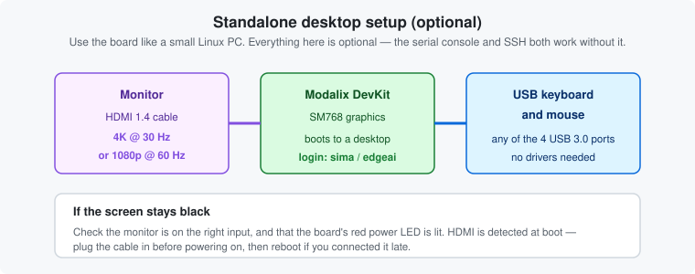
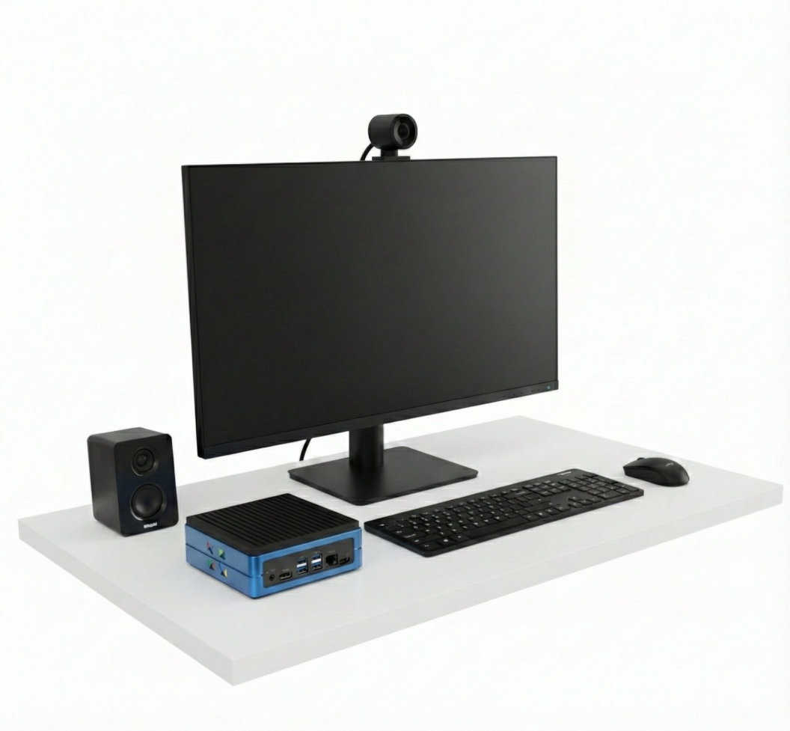

# Chapter 3 — HDMI, keyboard and mouse

*Using the DevKit as a standalone desktop machine. Entirely optional.*

---

## Do you need this chapter?

**Probably not.** Almost all development happens over SSH or through the serial console, with your
editor on your laptop. A monitor is useful for exactly two things:

- Confirming the board boots when the network isn't cooperating
- Demos, where showing output on a screen is the point

If neither applies, skip to [Chapter 4](04-serial-console.md).

---

## Connecting it up



1. **HDMI cable** from the DevKit to your monitor. Not supplied.
2. **USB keyboard and mouse** into any of the four USB 3.0 ports. No drivers, no configuration.
3. Power on. The board boots to a desktop.
4. Log in with username: `sima` / password: `edgeai`.



---

## If the screen stays black

Work through these in order:

1. **Is the board actually on?** The red power LED next to the barrel jack should be lit. No LED
   means a power problem, not a display problem.
2. **Is the monitor on the right input?** The most common cause by a distance.
3. **Was the cable connected before power-on?** HDMI is detected during boot. If you plugged it in
   afterwards, reboot:
   ```bash
   sima@modalix:~$ sudo reboot
   ```
4. **Try a different cable or monitor.** HDMI 1.4 is undemanding, but marginal cables do fail.
5. **Confirm the board is alive over serial** — see [Chapter 4 · The serial console](04-serial-console.md).
   If serial gives you a prompt, the board is fine and the problem is purely the display path.

---

## A note on running headless

Nothing in the rest of this guide requires a monitor. The board is designed to be driven over the
network, and when the network is broken, over serial. If you are setting up several boards, skip
the monitor entirely.

---

| ← Previous | Contents | Next → |
|:---|:---:|---:|
| [Chapter 2 · The board and its connections](02-board-and-connections.md) | [All chapters](../README.md) | [Chapter 4 · The serial console](04-serial-console.md) |
