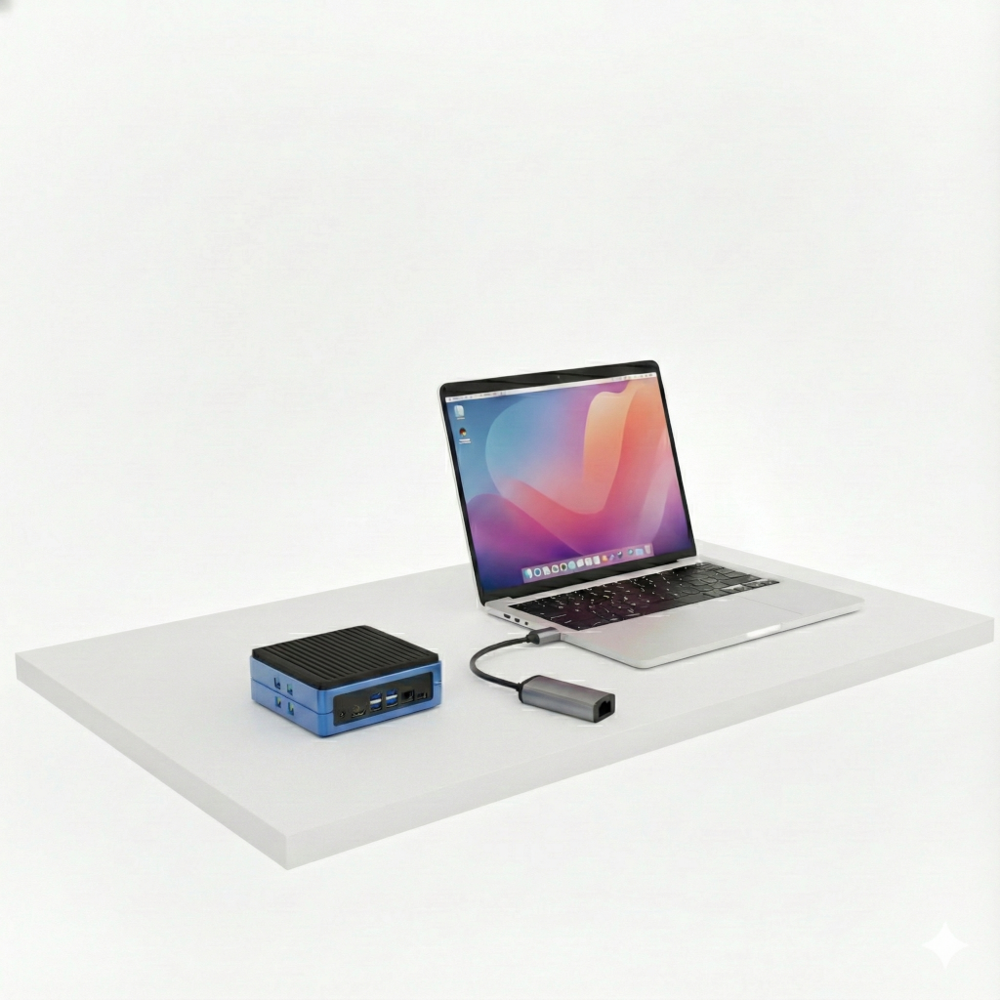
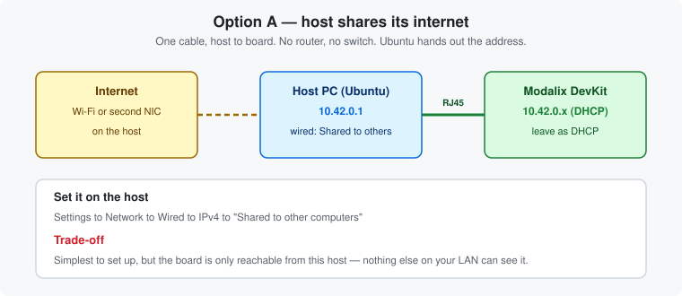

# Chapter 5 — Share the host's internet

*One cable from your laptop to the board. No router needed.*

> **Pick one networking chapter.** This one, [Chapter 6](06-connect-to-router.md) or
> [Chapter 7](07-static-connection.md) — they are alternatives. If you have a router available,
> [Chapter 6](06-connect-to-router.md) is simpler and gives a better result.

---

## When to use this

Your host PC is on Wi-Fi and the DevKit has no network drop of its own. The host lends the board its
internet connection over the Ethernet port. One cable, no router configuration.





The trade-off: **the board is only reachable from that host.** Nothing else on your network can see
it, and it disappears when you unplug the laptop.

---

## Ubuntu host

1. **Settings → Network → Wired → ⚙ → IPv4**
2. Set **IPv4 Method** to **Shared to other computers**
3. Apply, then toggle the wired connection off and on
4. Connect the cable from host to DevKit and power the board on

The host now runs DHCP and NAT on `10.42.0.0/24` — it takes `10.42.0.1` and hands the board
something like `10.42.0.203`.

Find the board:

```bash
sima-user@host:~$ sima-cli device discover
```

or, if you prefer:

```bash
sima-user@host:~$ nmap -sn 10.42.0.0/24 | grep report      # sudo apt install nmap
```

Then connect:

```bash
sima-user@host:~$ ssh sima@10.42.0.203
```

> **The board must be on DHCP** for this to work. That is the factory default — but if you
> previously set a static address, switch it back first. See
> [Switching between DHCP and static](#switching-between-dhcp-and-static) below.

---

## Switching between DHCP and static

The board ships with two NetworkManager profiles already defined: `end0-dhcp` and `end0-static`.
Switching is a matter of bringing the one you want up.

Do this over the [serial console](02-board-and-connections.md#the-serial-console--your-safety-net).
You are changing the network out from under yourself, so an SSH session will drop mid-command.

### To DHCP

Required for this chapter, and for [Chapter 6](06-connect-to-router.md):

```bash
sima@modalix:~$ sudo nmcli connection up end0-dhcp
sima@modalix:~$ nmcli -f NAME,DEVICE,STATE connection show --active
sima@modalix:~$ networkctl status
```

### To static

Required for [Chapter 7](07-static-connection.md):

```bash
sima@modalix:~$ sudo nmcli connection up end0-static
sima@modalix:~$ nmcli -f NAME,DEVICE,STATE connection show --active
sima@modalix:~$ networkctl status
```

### Reading the output

`nmcli ... show --active` confirms **which profile won** — look for `end0-dhcp` or `end0-static`
against device `end0` in state `activated`. `networkctl status` then shows the address actually in
effect, which is what you want before trusting anything else.

If the profile activates but no address appears, nothing is serving DHCP on the other end — go back
and check the host's sharing setting.

> **`sima-cli network` does the same thing interactively**, if it is available on your board. It
> walks the profiles and is easier to remember. The `nmcli` commands above are the fallback when it
> is not installed, and they are what `sima-cli network` drives underneath.

---

## Windows host

*A Windows procedure, not a SiMa-specific one.*

1. **Control Panel → Network and Sharing Center → Change adapter settings**
2. Right-click the adapter that **has** internet (Wi-Fi) → **Properties** → **Sharing**
3. Tick **Allow other network users to connect through this computer's Internet connection**, and
   select your **Ethernet** adapter
4. Windows takes `192.168.137.1` and serves DHCP on `192.168.137.0/24`
5. Read the board's address from its serial console with `ip a | grep inet`, then
   `ssh sima@192.168.137.<n>`

---

## macOS host

*A macOS procedure, not a SiMa-specific one.*

1. **System Settings → General → Sharing → Internet Sharing**
2. **Share from:** Wi-Fi · **To computers using:** Ethernet
3. Enable it. macOS serves DHCP on `192.168.2.0/24`
4. Read the board's address over serial, then `ssh sima@192.168.2.<n>`

---

## Verify the board actually has internet

Everything later in this guide — `sima-cli`, updates, package installs — depends on this. Check it
now rather than debugging it later:

```bash
sima@modalix:~$ ping -c3 8.8.8.8              # routing works
sima@modalix:~$ ping -c3 developer.sima.ai    # DNS works too
```

If the first succeeds and the second fails, you have a DNS problem, not a routing problem.

---

## If the board gets an address but no internet

On Ubuntu 24.04 this is usually a firewall dropping forwarded traffic. On the **host**:

```bash
sima-user@host:~$ sysctl net.ipv4.ip_forward                        # expect: = 1
sima-user@host:~$ sudo iptables -t nat -L POSTROUTING -n | grep MASQUERADE
```

If forwarding is off or the MASQUERADE rule is missing, the host isn't actually routing. See
[Troubleshooting](troubleshooting.md#the-board-has-an-ip-but-no-internet).

---

| ← Previous | Contents | Next → |
|:---|:---:|---:|
| [Chapter 4 · The serial console](04-serial-console.md) | [All chapters](../README.md) | [Chapter 6 · Connect to a router](06-connect-to-router.md) |
