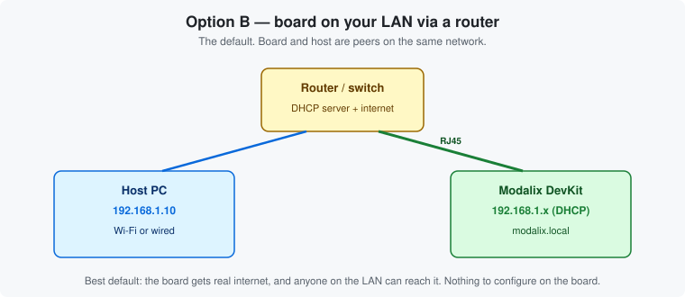

# Chapter 6 — Connect to a router

*The recommended path. Plug it into your network and let DHCP do the work.*

> **Pick one networking chapter.** This one or [Chapter 5](05-internet-sharing.md) — they are
> alternatives.

---

## Why this one

The board arrives configured for DHCP. Plug it into a router and it gets an address and an internet
route with no configuration at all. It is reachable from **every** machine on your LAN, not just one
laptop, and it stays reachable when you close your laptop lid.



---

## Steps

1. Plug the DevKit's Ethernet port into the same switch or router as your host PC.
2. Power the board on.
3. Find its address. Either from the board over [serial](02-board-and-connections.md#the-serial-console--your-safety-net):

   ```bash
   sima@modalix:~$ ip a | grep inet
   ```

   Look for the address on `end0`. Or from your host:

   ```bash
   sima-user@host:~$ sima-cli device discover
   ```

4. Connect:

   ```bash
   sima-user@host:~$ ssh sima@<board-ip>
   ```

That is the whole procedure.

---

## Using the hostname instead

The board advertises itself over mDNS as `modalix.local`:

```bash
sima-user@host:~$ ssh sima@modalix.local
```

Convenient when the IP changes. It relies on mDNS working on your network — many corporate networks
block it, and it is unreliable across VLANs. If it doesn't resolve, fall back to the IP; see
[Troubleshooting](troubleshooting.md#ssh-simamodalixlocal-does-not-resolve).

---

## Verify internet access

Do this now. Every later chapter depends on it:

```bash
sima@modalix:~$ ping -c3 8.8.8.8              # routing works
sima@modalix:~$ ping -c3 developer.sima.ai    # DNS works too
```

If the address ping succeeds and the name ping fails, your DNS is wrong, not your routing.

---

## Keeping the same address

DHCP leases can change across reboots, which is mildly annoying when you have scripts pointing at an
IP. The fix: **a DHCP reservation on your router**, tied to the board's MAC address. Best of both
— the board stays on DHCP, but always gets the same address.

Find the MAC address with:

```bash
sima@modalix:~$ ip link show end0
```

To switch the board itself between DHCP and its default static profile, see
[Chapter 5 · Guided configuration with sima-cli](05-internet-sharing.md#guided-configuration-with-sima-cli-optional).
That optional menu requires `sima-cli` installed on the board ([Chapter 7](07-install-sima-cli.md#install-on-the-board));
Chapter 5 also includes [`nmcli` commands](05-internet-sharing.md#to-dhcp) for returning to DHCP
before the CLI is installed.

---

| ← Previous | Contents | Next → |
|:---|:---:|---:|
| [Chapter 5 · Share the host's internet](05-internet-sharing.md) | [All chapters](../README.md) | [Chapter 7 · Install sima-cli](07-install-sima-cli.md) |
