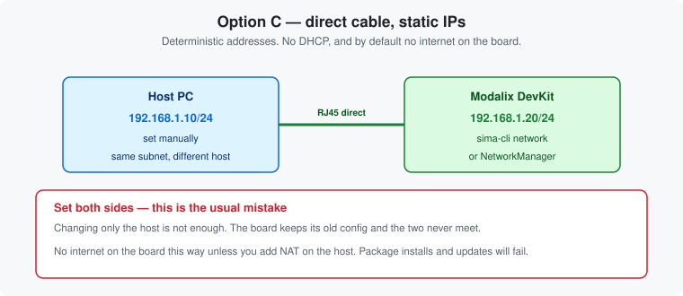

# Chapter 7 — Static IP connection

*A fixed, predictable address on a direct cable. Deterministic, and easy to get half-right.*

> **Pick one networking chapter.** This one, [Chapter 5](05-internet-sharing.md) or
> [Chapter 6](06-connect-to-router.md) — they are alternatives.

---

## When to use this

A lab bench where the address must never change, or a host whose network settings you cannot alter.
Direct cable between host and board, both sides configured by hand.



> **This gives you host-to-board connectivity, not internet on the board.** Package installs,
> `sima-cli update` and model downloads will all fail until you add NAT — see
> [below](#giving-the-board-internet-over-a-static-link).

---

## The mistake almost everyone makes

**You must configure both ends.** Setting a static address on the host while the board is still on
DHCP leaves the two on different subnets, with no path between them. The board will look dead.

Both addresses must be in the **same subnet** and **different** from each other:

| | Address |
|---|---|
| Host | `192.168.1.10/24` |
| DevKit | `192.168.1.20/24` |

---

## On the board

Connect over [serial](02-board-and-connections.md#the-serial-console--your-safety-net) — you are
about to change the network, so do not rely on the network.

```bash
sima@modalix:~$ sudo nmcli connection modify end0-static ipv4.addresses 192.168.1.20/24
sima@modalix:~$ sudo nmcli connection up end0-static
sima@modalix:~$ nmcli -f NAME,DEVICE,STATE connection show --active
```

The board ships with an `end0-static` profile already defined, so the third command above is just
bringing it up. Confirm it took, and see the address that actually resulted:

```bash
sima@modalix:~$ networkctl status
```

> `sima-cli network` does the same thing interactively if it is available on your board. Both
> directions of the switch are written out in
> [Chapter 4 · Switching between DHCP and static](05-internet-sharing.md#switching-between-dhcp-and-static).

---

## On the host

```bash
sima-user@host:~$ sudo ip addr add 192.168.1.10/24 dev <host-iface>
sima-user@host:~$ sudo ip link set <host-iface> up
```

Find `<host-iface>` with `ip link` — it is the wired interface facing the board.

> Addresses set with `ip addr add` do not survive a reboot. For something permanent, configure it
> in NetworkManager or netplan on the host.

---

## Test both directions

Both, not just one — a one-way failure points at a firewall rather than addressing:

```bash
sima-user@host:~$ ping -c3 192.168.1.20     # host  → board
sima@modalix:~$   ping -c3 192.168.1.10     # board → host
```

Then:

```bash
sima-user@host:~$ ssh sima@192.168.1.20
```

---

## Giving the board internet over a static link

Turn the host into a router. `<wan>` is the interface with internet (e.g. `wlp3s0`), `<lan>` is the
one facing the board:

```bash
sima-user@host:~$ sudo sysctl -w net.ipv4.ip_forward=1
sima-user@host:~$ sudo iptables -t nat -A POSTROUTING -o <wan> -j MASQUERADE
sima-user@host:~$ sudo iptables -A FORWARD -i <lan> -o <wan> -j ACCEPT
sima-user@host:~$ sudo iptables -A FORWARD -i <wan> -o <lan> -m state --state RELATED,ESTABLISHED -j ACCEPT
```

On the board, point at the host as gateway and set a DNS server:

```bash
sima@modalix:~$ sudo nmcli connection modify end0-static ipv4.gateway 192.168.1.10
sima@modalix:~$ sudo nmcli connection modify end0-static ipv4.dns 8.8.8.8
sima@modalix:~$ sudo nmcli connection up end0-static
```

Verify:

```bash
sima@modalix:~$ ping -c3 8.8.8.8
sima@modalix:~$ ping -c3 developer.sima.ai
```

Neither the `sysctl` nor the `iptables` rules survive a host reboot. Make them permanent if you
intend to keep this setup.

---

## Going back to DHCP

```bash
sima@modalix:~$ sudo nmcli connection up end0-dhcp
sima@modalix:~$ nmcli -f NAME,DEVICE,STATE connection show --active
sima@modalix:~$ networkctl status
```

Do it over the [serial console](02-board-and-connections.md#the-serial-console--your-safety-net) —
you are removing the very address you would be connected on.

`sima-cli network` offers the same switch interactively where it is available. Full detail in
[Chapter 4 · Switching between DHCP and static](05-internet-sharing.md#switching-between-dhcp-and-static).

---

| ← Previous | Contents | Next → |
|:---|:---:|---:|
| [Chapter 6 · Connect to a router](06-connect-to-router.md) | [All chapters](../README.md) | [Chapter 8 · Install sima-cli](08-install-sima-cli.md) |
