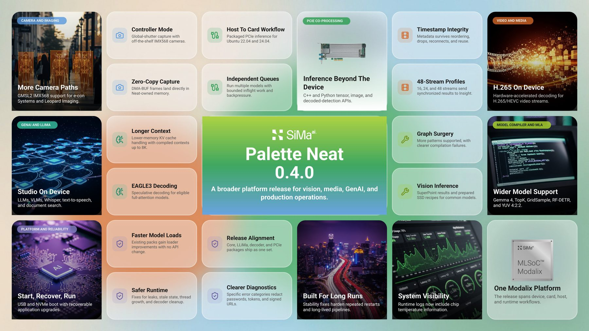

# Chapter 14 — The Neat stack

*What each piece of Neat is, where it runs, and which repository it comes from.*

---

## What Neat is

Neat is SiMa.ai's application-development framework: a Python and C++ programming model for
composing AI applications, plus the runtime that executes them on Modalix. It sits at the
application layer — above the compiled model, below your product — and covers model artifacts,
pipeline composition and execution on DevKits and SiMa.ai SoCs.

  

Everything in Chapters 1–13 used Neat from the board's side: `pyneat` to run a model, `sima-cli` to
install things, LLiMa to pull a language model. This chapter names the rest of the stack, most of
which lives on your **host** rather than the DevKit.

---

## The components

| Component | What it is | Where it runs |
|---|---|---|
| **Host** | Your development machine: `sima-cli`, a container runtime, the shared workspace | Host |
| **Modalix DevKit** | The target hardware running Modalix firmware, where applications execute | Board |
| **Neat SDK** | Containerised environment for building C++ apps, preparing model artifacts, and pairing with the board | Host (container) |
| **Neat Core** | The runtime C++ libraries that power model execution and the app APIs | Board + SDK |
| **pyneat** | Python bindings for the same runtime — prototyping and scripting | Board + SDK |
| **Model Compiler** | Optional toolchain that compiles and quantises ONNX or GenAI models for Modalix | Host (container) |
| **Neat Insight** | Browser-based inspection console for streams, files and runtime logs | Host or board |
| **Neat Apps** | The example applications, and eventually yours | Board |

  

The important relationship: the SDK container, the host and the DevKit share **one workspace
folder**. You edit on the host, build in the container, run on the board, and never copy a file by
hand. [Chapter 15](15-install-neat-sdk.md) sets that up.

---

## Repository map

Neat is developed in the open at [github.com/sima-neat](https://github.com/sima-neat). When you
need the source, the issue tracker or the reference docs, this is where each piece lives:

| Repository | Purpose |
|---|---|
| [**core**](https://github.com/sima-neat/core) | Neat Library APIs, tutorials and documentation source |
| [**sdk**](https://github.com/sima-neat/sdk) | The Neat Development Environment — integrated development and cross-compilation |
| [**model-compiler**](https://github.com/sima-neat/model-compiler) | Model Compiler tooling for preparing models for SiMa.ai hardware |
| [**apps**](https://github.com/sima-neat/apps) | Example applications and reference pipeline patterns |
| [**sima-cli**](https://github.com/sima-neat/sima-cli) | Developer utilities for setup, assets and workflow automation |
| [**insight**](https://github.com/sima-neat/insight) | Runtime inspection, media routing and interactive testing |
| [**llima**](https://github.com/sima-neat/llima) | Runtime and compile-time tooling for LLM and VLM workloads |
| [**playbooks**](https://github.com/sima-neat/playbooks) | Coding-agent playbooks for common Neat development workflows |

---

## What you have already used

| You did this | It came from |
|---|---|
| `sima-cli download`, `sima-cli update` ([Chapter 7](07-install-sima-cli.md)) | `sima-cli` |
| `import pyneat` ([Chapter 11](11-install-pyneat.md)) | `core` |
| `sima-cli neat install apps` ([Chapter 11](11-install-pyneat.md)) | `apps` |
| Object detection on the MLA ([Chapter 12](12-object-detection.md)) | `core` + `apps` |
| `llima run` ([Chapter 13](13-llima.md)) | `llima` |

The two you have not met yet are the **SDK** and **Insight** — the rest of this part.

---

| ← Previous | Contents | Next → |
|:---|:---:|---:|
| [Chapter 13 · LLiMa](13-llima.md) | [All chapters](../README.md) | [Chapter 15 · Install the Neat SDK](15-install-neat-sdk.md) |
