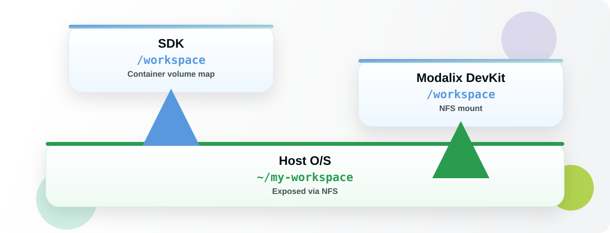

# Chapter 15 — Install the Neat SDK

*The host-side development environment: one command, eight prompts, one shared workspace.*

---

## Why you want it

Everything so far ran **on the board**. That is fine for scripts and for running what already
exists. It stops being fine when you want to build C++ applications, compile your own models, or
edit code in a real editor.

The Neat SDK is a container on your **host** that cross-compiles for Modalix, holds the model
tooling, and — the part that matters day to day — shares one workspace folder with both the host
and the DevKit. You edit on the host, build in the container, run on the board. No `scp` in the
loop.

> **On Windows?** The stack is the same but goes through WSL2. Follow the
> [Windows guide](../../installation/neat_on_windows.md) instead of this chapter.

---

## Before you start

| Requirement | Detail |
|---|---|
| **Host OS** | Ubuntu 22.04 / 24.04 (recommended), Windows 11 via WSL2 (x86_64), or macOS 15.5+ Apple Silicon |
| **Tools** | `sudo`, Git, `curl` / `wget`, and a container runtime — Docker or Colima |
| **Disk** | ~10 GB free, plus ~10 GB more if you add the Model Compiler |
| **Network** | Host and DevKit must reach each other — confirm `ping <devkit-ip>` works from the host |
| **DevKit IP** | From [Chapter 6](06-connect-to-router.md). You can install without it and pair later |

Install `sima-cli` on the **host** — this is the host copy, separate from the one you installed on
the board in [Chapter 7](07-install-sima-cli.md):

```bash
sima-user@host:~$ curl -fsSL https://artifacts.neat.sima.ai/sima-cli/linux-mac.sh | bash
```

---

## Install

One command, on the host:

```bash
sima-user@host:~$ sima-cli neat install sdk@release-2.1
```

There is no separate setup step afterwards — it is one continuous flow that:

1. Pulls the Neat SDK Docker image.
2. Creates the SDK container and installs the SDK into it.
3. Pairs with the Modalix DevKit.
4. Shares one workspace folder between host, container and board.
5. Installs Neat Core into the container, and onto the paired DevKit.

`release-2.1` tracks the latest patch in the 2.1 series. For the set this guide uses — board
software **2.1.3** — that is SDK **2.1.3.0**; check it against the table in
[Chapter 9](09-check-and-update-image.md#which-version-should-you-be-on). The board, the SDK and
the Neat Library move as a set.

The first install takes several minutes.

> **SDK 2.0.0, 2.1.2.0 or 2.1.2.1** use the older two-step install (image pull, then
> `sima-cli sdk setup`). See
> [Two Step SDK Installation](https://developer.sima.ai/software/reference/two-step-sdk-installation/).
> The prompts below are the same either way.

---

## The eight prompts

Setup is a series of prompts. Everything you actually have to decide is here; the rest is `Enter`.

| # | Prompt | Answer | Why |
|---|---|---|---|
| 1 | Pair this SDK with a DevKit now? `[y/N]` | `y`, then the DevKit IP | `N` is fine too — the workspace is still created, and you can pair later with `sima-cli sdk setup --devkit <devkit-ip>` |
| 2 | Some system checks failed — continue anyway? `[y/N]` | `y` **if** the only failure is a `Firewall` warning | Anything else is worth reading before you continue |
| 3 | SDK Docker image | `Enter` | The image you just downloaded is pre-selected |
| 4 | Host workspace path | `Enter` | Or type your own. This is the folder that gets shared |
| 5 | SDK extension | `Enter` | |
| 6 | Create a new SDK container? | **First install:** create it. **Every later run:** `n` | ⚠️ The one that matters. `y` on a repeat run builds a second container and reinstalls from scratch |
| 7 | Install the Model Compiler extension? | `n`, unless you need to compile ONNX or GenAI models | ~15 minutes and ~10 GB. You can add it later |
| 8 | DevKit workspace path | `Enter` for `/workspace` | Mounts the host workspace onto the board. Password, if asked: `edgeai` |

<p align="center">
  
</p>

**Running setup again later** re-pulls nothing:

```bash
sima-user@host:~$ sima-cli sdk setup --devkit <devkit-ip>
```

…and press `n` at prompt 6 to reuse the container you already have.

---

## Attach VS Code

1. Install [VS Code](https://code.visualstudio.com/download) on the host. On Ubuntu:

   ```bash
   sima-user@host:~$ sudo apt update && sudo snap install code --classic
   ```

2. Install Microsoft's **Dev Containers** extension.

3. Command Palette (`Ctrl+Shift+P`) → **Dev Containers: Attach to Running Container…** → pick the
   `sima-neat/sdk` container.

4. In the attached window, open `/workspace`.

Screenshots of every step are in the
[full installation guide](../../installation/README.md#walkthrough).

---

## Check it works

From inside the attached container, `dk` runs things on the paired board. Save this as
`hello_neat.py`:

```python
import pyneat
print("pyneat import successful")
```

Then:

```bash
sima-user@sdk:/workspace$ dk hello_neat.py        # a pyneat script
sima-user@sdk:/workspace$ dk build/<binary-name>  # a compiled C++ binary
```

If it prints, the runtime is live on the DevKit and the workspace share is working.

---

## When it goes wrong

| Symptom | Fix |
|---|---|
| Version mismatch errors | `cat /etc/buildinfo` on the board, then pin the SDK and Model Compiler to match — [Chapter 9](09-check-and-update-image.md#which-version-should-you-be-on) |
| Pairing fails | Host and DevKit must be on the same network and able to `ping` each other. Check firewall rules |
| Setup reinstalls everything | You pressed `y` at prompt 6. Press `n` to reuse the existing container |
| You are copying files by hand | Don't — use the shared `/workspace` that pairing set up |

---

## Also available

| Thing | Where |
|---|---|
| Model Compiler, added later | `sima-cli install -v 2.1.3 tools/model-compiler/amd64` |
| Neat Insight, already bundled with the SDK | [Chapter 16](16-neat-insight.md) |
| The long-form install guide, with screenshots | [installation/README.md](../../installation/README.md) |
| Compatibility matrix | [developer.sima.ai](https://developer.sima.ai/software/getting-started/compatibility/) |

---

| ← Previous | Contents | Next → |
|:---|:---:|---:|
| [Chapter 14 · The Neat stack](14-neat-components.md) | [All chapters](../README.md) | [Chapter 16 · Neat Insight](16-neat-insight.md) |
