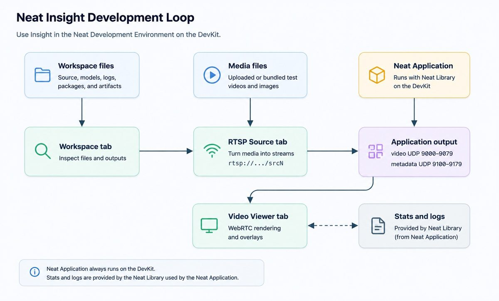
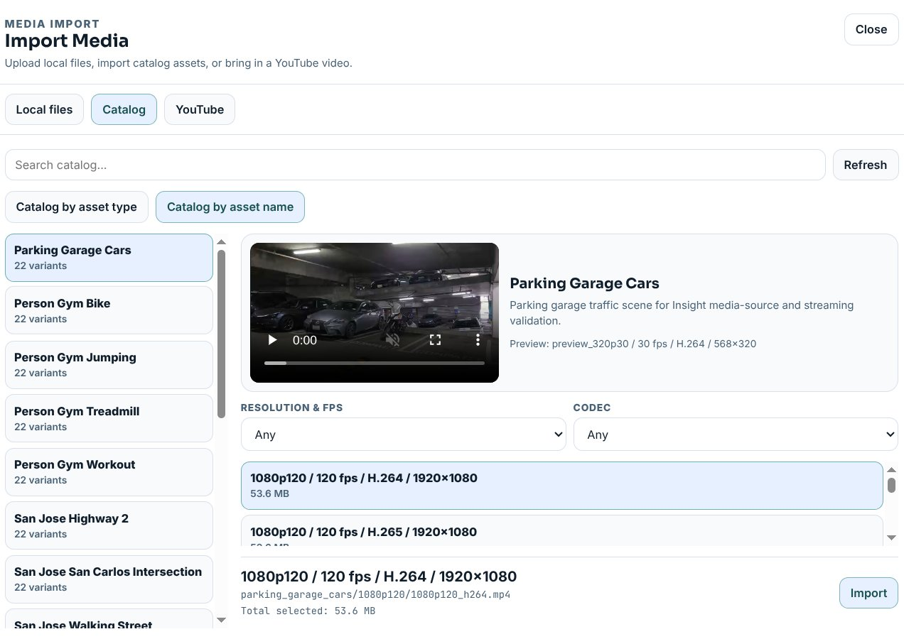
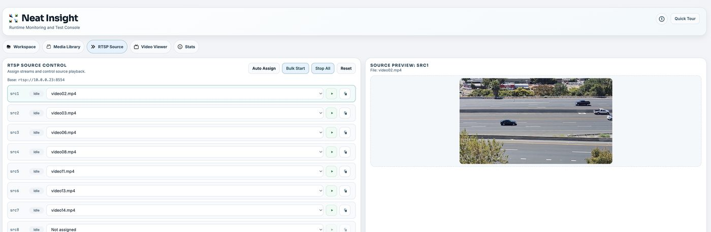
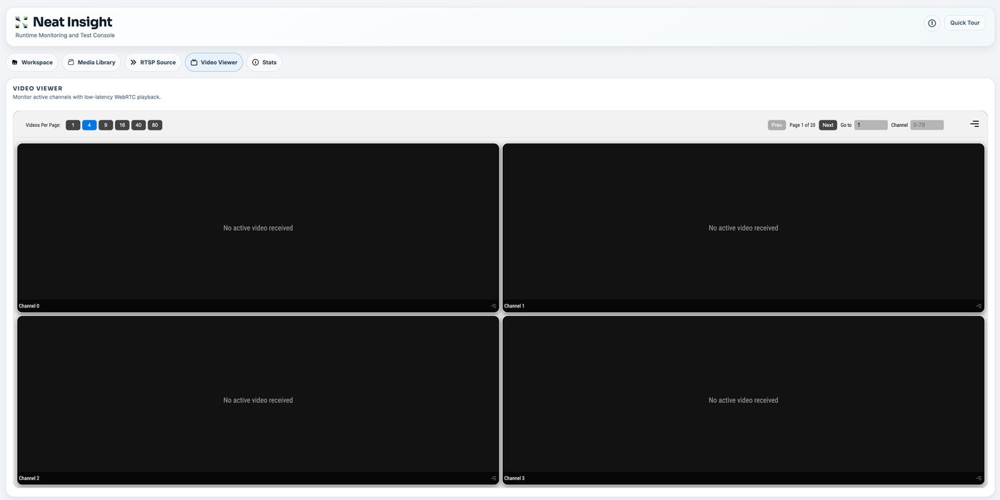

# Chapter 17 — Neat Insight

*The browser console for seeing what your application is actually doing.*

---

## What it is

Insight is a browser-based inspection and test console for Neat vision applications. It answers the
questions that are tedious to answer from a terminal: is the video arriving, on which channel, is
the metadata aligned with the frames, what is in the workspace, and what did the runtime log while
it all happened.

It also solves the practical problem of having no camera on your desk — upload a video file and
Insight turns it into a live RTSP source your application can consume.

The development loop it supports:

<p align="center">
  
</p>

---

## Opening it

Insight is **bundled with the Neat SDK** ([Chapter 15](15-install-neat-sdk.md)). When the SDK
container starts, Insight is installed, configured and supervised automatically — there is nothing
to install.

**Ask the SDK for the URL.** Run `neat` inside the SDK container:

```bash
sima-user@sdk:/workspace$ neat
```

```text
Components
  neat-insight           0.0.6 channel=release status=Running venv=/opt/neat-insight/venv

Exposed Ports
  Insight Web UI     https://10.0.0.22:9900

  Name               Protocol Host Port (Start) Host Port (End)
  ------------------ -------- ----------------- ---------------
  mainUI             tcp      9900              -
  metadataUDP        udp      9100              9179
  rtsp.tcp           tcp      8554              -
  videoUDP           udp      9000              9079
  webRTC             udp      40000             40199
```

**Insight Web UI** is the address to open in your browser. `status=Running` confirms the service is
up. Do not assume 9900 — the SDK picks another host port if 9900 is already taken, and the table is
the only place that tells you which one it used.

The same table gives you the ports your application will send to: `videoUDP` from 9000 and
`metadataUDP` from 9100, one port per channel. [Chapter 18](18-cpp-video-app.md) uses both.

For scripting, `neat --json` gives the same information — read `insight.webUiUrl` and the
`exposedPorts` array.

| Browsing from | URL |
|---|---|
| The machine running the SDK | <https://localhost:9900> |
| Another machine on the network | `https://<host-ip>:9900` |

It is **HTTPS with a self-signed certificate**, so accept the browser warning. If the page does not
load at all:

```bash
sima-user@sdk:/workspace$ insight-admin status
```

---

## The tabs

| Tab | What it does |
|---|---|
| **Workspace** | Browse project files and inspect generated model, package and profiling artifacts |
| **Media Library** | Get test media in three ways — local upload, the built-in catalog, or a YouTube URL — then preview, inspect and delete it |
| **RTSP Source** | Turn uploaded media into live streams on three paths: `src1`, `src2`, `src3`, port `8554` |
| **Video Viewer** | WebRTC output with metadata overlays — detection, classification, pose, segmentation, tracking |
| **Stats** | System and application metrics |

Before you start a stream, check two things: the **NMS mount** is present on the workspace, and the
paired **devkit-ip** shows in the top-right corner of the UI.

---

## Getting test media in

**Media Library → Import Media** offers three routes, as tabs across the top of the dialog:

<p align="center">
  
</p>

### Local files

Upload your own clip — `mp4`, `mov`, `avi`, `mkv` or `webm`. Use this when you are testing against
footage that matters to you: your own camera, a customer sample, the awkward scene that breaks
your pipeline.

### Catalog *(the easy option)*

A built-in library of scenes prepared for exactly this job — parking garages, gym activity,
highway and intersection traffic, people walking. Browse by **asset type** or **asset name**, or
search.

What makes the catalog worth reaching for first is that each scene ships as **22 variants**. Pick
the asset, then pick the encoding you actually want:

| Control | What it gives you |
|---|---|
| **Resolution & FPS** | From small previews up to `1080p120` — so you can choose `720p30` and match it exactly in your application config |
| **Codec** | H.264 or H.265, which is what your `source.codec` setting has to agree with |
| Variant list | Every combination, each with its download size — `1080p120 / 120 fps / H.264 / 1920×1080`, 53.6 MB |

Selecting a variant shows its path and total size before you commit:

```text
parking_garage_cars/1080p120/1080p120_h264.mp4
Total selected: 53.6 MB
```

Press **Import**. No transcoding, no guessing at frame rates — you know the resolution, fps and
codec because you chose them, which is precisely what the application config needs to be told.

### YouTube

Paste a YouTube URL and Insight brings the video in. Handy for grabbing a scene resembling your
deployment when you have neither your own footage nor a catalog asset that fits.

---

## Turning a video file into an RTSP source

1. Open Insight in a browser and go to **Media Library**. Import your video by any of the three
   routes above.

2. Go to **RTSP Source**. Assign files to `src1`, `src2` or `src3` by hand, or use **auto-assign**
   to spread unique files across the slots. Start one source, or bulk-start all of them.

   <p align="center">
     
   </p>

3. Point your application at the source — `rtsp://127.0.0.1:8554/src1` — and run it.

4. Watch the result in **Video Viewer**, where you can confirm that frames are arriving on the
   channel you expect and that the overlays line up with them.

   <p align="center">
     
   </p>

---

## When it goes wrong

| Symptom | Fix |
|---|---|
| Page will not load | `insight-admin status` to confirm it is up, then re-check the port with `neat --json` |
| Certificate warning | Expected — Insight generates its own certificate. Accept it |
| No video in the viewer | Confirm the RTSP source is started, and that the application is pointed at the same `src` path |
| No `devkit-ip` in the corner | The SDK is not paired. Re-run `sima-cli sdk setup --devkit <devkit-ip>` |

---

## Where to read more

- [Insight documentation](https://developer.sima.ai/software/tools/insight/) — the primary reference
- [Concepts](https://developer.sima.ai/software/tools/insight/concepts) ·
  [Install and upgrade](https://developer.sima.ai/software/tools/insight/install-upgrade) ·
  [User interface](https://developer.sima.ai/software/tools/insight/user-interface)
- [github.com/sima-neat/insight](https://github.com/sima-neat/insight) — source, releases and issues
- [neat_insight.md](../../installation/neat_insight.md) — the longer version of this chapter

---

| ← Previous | Contents | Next → |
|:---|:---:|---:|
| [Chapter 16 · The `dk` command](16-devkit-tool-dk.md) | [All chapters](../README.md) | [Chapter 18 · A C++ video application](18-cpp-video-app.md) |
