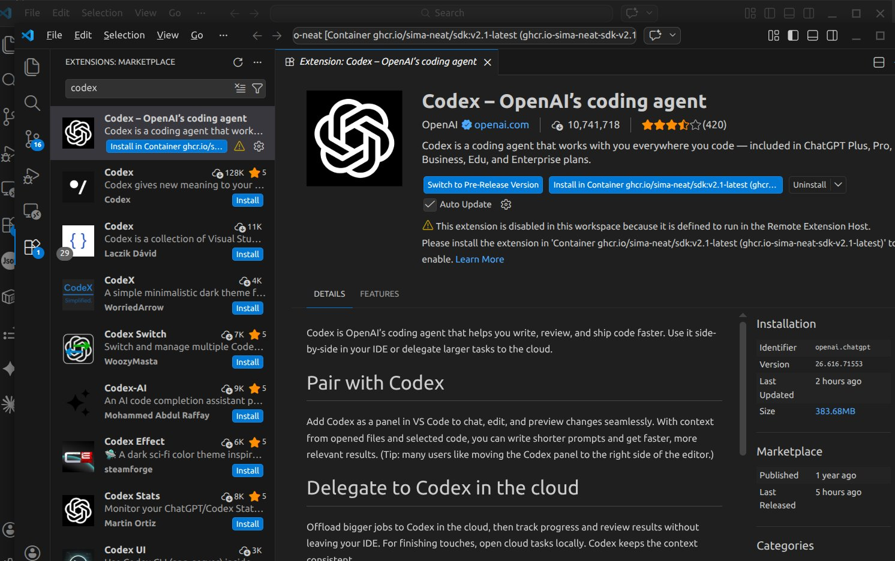
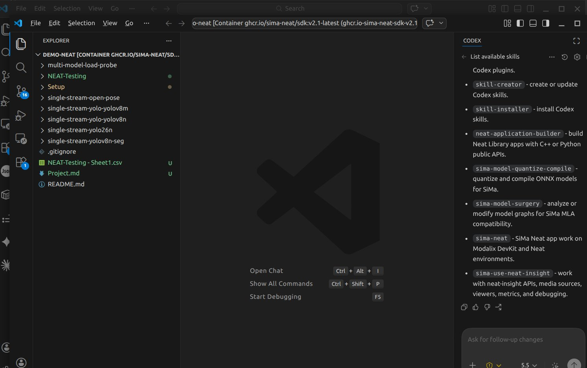

# Chapter 19 — Agentic development

*Describe the application to a coding agent. It builds it, runs it on the board, and fixes what fails.*

---

## What it is

The Neat SDK ships with **SiMa skills** for two coding agents, Codex and Claude Code. A skill is a
packaged set of instructions that points the agent at the current Neat source, headers, examples and
workflows, so it writes against the real API instead of guessing.

With a skill loaded, the agent can do what Chapter 18 did by hand: write the application, build it
in the SDK, run it on the paired DevKit with `dk`, read the output, and refine the code until it
works.

<p align="center">
  
</p>

---

## Before you start

| Requirement | Chapter |
|---|---|
| Neat SDK installed | [15](15-install-neat-sdk.md) |
| `dk status` names your DevKit | [16](16-devkit-tool-dk.md) |
| Insight open in a browser, for video prompts | [17](17-neat-insight.md) |
| A Codex or Claude account | See Step 4 |

---

## Step 1 — Start the SDK

On the host, pressing `n` at prompt 6 to reuse your container:

```bash
sima-user@host:~$ sima-cli sdk setup --devkit <devkit-ip>
```

---

## Step 2 — Open VS Code and install Dev Containers

1. Open VS Code on the host.
2. Open **Extensions** (`Ctrl+Shift+X`), search for **Dev Containers**, and install Microsoft's
   extension.

---

## Step 3 — Attach to the SDK container

1. Command Palette (`Ctrl+Shift+P`) → **Dev Containers: Attach to Running Container…**
2. Pick the `sima-neat/sdk` container.
3. In the attached window, open `/workspace`.

Everything from here happens in this attached window.

---

## Step 4 — Install a coding agent

Pick one:

| Agent | Account you need |
|---|---|
| **Codex** (OpenAI) | A ChatGPT account. **Use Codex if you do not have a paid account** — it also works with a free one |
| **Claude Code** (Anthropic) | A paid Claude plan (Pro, Max, Team or Enterprise) or an Anthropic Console account |

In the attached window, open **Extensions**, search for **Codex** or **Claude Code**, and press
**Install in Container** — not the plain Install. The agent has to run inside the SDK container to
see the SiMa skills and the workspace.

<p align="center">
  
</p>

---

## Step 5 — Log in

Open the agent's panel from the sidebar and sign in:

- **Codex:** **Sign in with ChatGPT**, then complete the login in your browser.
- **Claude Code:** sign in with your Claude account, then complete the login in your browser.

---

## Step 6 — Check the SiMa skills are loaded

Ask the agent:

```text
List available skills
```

The answer should include the SiMa skills:

| Skill | Use it for |
|---|---|
| `neat-application-builder` | Building Neat apps in C++ or Python |
| `sima-neat` | Neat work on the DevKit and in the SDK *(Codex only)* |
| `sima-use-neat-insight` | Insight: media sources, streams, viewer, metrics |
| `sima-model-quantize-compile` | Quantising and compiling ONNX models for Modalix |
| `sima-model-surgery` | Changing a model graph so it runs on the MLA |
| `sima-llima-compile-run` | Compiling and running LLMs and VLMs with LLiMa |

<p align="center">
  
</p>

If none of them appear, the agent is running outside the container — go back to Step 4 and use
**Install in Container**.

---

## Step 7 — Prompts to try

Copy a prompt, replace anything in `<angle brackets>`, and send it. Start with the first and work
down.

**Get oriented**

```text
Which SiMa skill should I use to build a Neat application, and which example in the
Neat apps is closest to RTSP object detection?
```

**Object detection on images (Python)** — the agent's version of [Chapter 12](12-object-detection.md).
Put a few images in the folder first — for example the six samples from this repository:

```bash
sima-user@host:~$ mkdir -p ~/workspace/agent-demo/images
sima-user@host:~$ cp demo-neat/tutorial/assets/images/image{,1,2,3,4,5}.png ~/workspace/agent-demo/images/
```


```text
Using the neat-application-builder skill, write a pyneat script at
/workspace/agent-demo/detect.py that runs YOLO26 object detection on every image in
/workspace/agent-demo/images and saves annotated images to /workspace/agent-demo/output.
First download the model yolo26m-det-bf16-mla_tess-b1.tar.gz into /workspace/agent-demo
with sima-cli download from
https://docs.sima.ai/pkg_downloads/SDK2.1.3/models/modalix/yolo26-detection/yolo26m-det-bf16-mla_tess-b1.tar.gz
Run the script on the DevKit with dk and show me the detections for each image.
```

**RTSP video to Insight (C++)** — the agent's version of [Chapter 18](18-cpp-video-app.md):

```text
Using the neat-application-builder skill, build a C++ Neat application in
/workspace/agent-rtsp that reads the H.264 RTSP stream <rtsp-url> (1280x720, 30 fps),
runs YOLO26 on the MLA, and sends the video and object-detection metadata to Insight
at <host-ip> (video UDP 9000, metadata UDP 9100). First download the model
yolo26m-det-bf16-mla_tess-b1.tar.gz into /workspace/agent-rtsp with sima-cli download from
https://docs.sima.ai/pkg_downloads/SDK2.1.3/models/modalix/yolo26-detection/yolo26m-det-bf16-mla_tess-b1.tar.gz
Build the app in the SDK with cmake, run it on the DevKit with dk, and confirm the boxes
appear in Insight.
```

**Fix something**

```text
The app in /workspace/agent-rtsp shows video in Insight but no boxes. Find out why
and fix it.
```

**Run a language model**

```text
Using LLiMa on the DevKit, pull a small LLM and write a Python example with
pyneat.genai that asks it a question and prints the answer.
```

---

## Keep a memory file and a progress file

A coding agent starts every session with a blank slate. Close VS Code, start a new chat, or run a
long task until the conversation fills up, and the agent forgets what it learned: your board's IP,
the build command that finally worked, the approach that failed an hour ago. Without notes it
rediscovers the same facts, retries the same dead ends, and sometimes undoes a decision you made
on purpose.

Two small Markdown files in the project fix that.

### The memory file: facts that stay true

Durable facts and rules for this project. Both agents read it automatically when it has the right
name in the project folder:

| Agent | File name |
|---|---|
| Codex | `AGENTS.md` |
| Claude Code | `CLAUDE.md` |

Put in what the agent would otherwise have to rediscover:

```markdown
# Project memory

## Environment
- DevKit: <devkit-ip>, user sima
- Insight host: <host-ip> — video UDP 9000, metadata UDP 9100
- Board software 2.1.3, SDK 2.1.3.0, Neat Library 0.4.0

## Build and run
- Build: cmake -S . -B build -DCMAKE_BUILD_TYPE=Release -DCMAKE_PREFIX_PATH=/opt/toolchain/aarch64/modalix/usr
- Run on the board: dk ./build/<binary> --config ./config.yaml

## Rules learned the hard way
- Keep every file under /workspace — dk refuses paths outside it.
- A graph built from one image is fixed to that image's size. Letterbox every image to 640x640.
```

Update it whenever something is learned the hard way, so it only has to be learned once.

### The progress file: where the work stands

A running log of the task, so any session — or anyone else — can pick up where the last one
stopped. Call it `PROGRESS.md`:

```markdown
# Progress

## Done
- [x] Model downloaded into /workspace/agent-rtsp
- [x] App builds; runs on the board with dk

## In progress
- [ ] Boxes appear in Insight but lag behind the video

## Next
- [ ] Add a second RTSP stream

## Decisions
- 720p30 H.264 input, to match the encoder settings
```

### Ask the agent to keep them

You do not have to write them yourself. Start a project with:

```text
Create AGENTS.md with the facts about this project's environment, build and run commands,
and keep it updated whenever we learn something new. Also keep PROGRESS.md updated after
every step: what is done, what is in progress, what is next, and any decisions we make.
Read both files at the start of every session.
```

Read them now and then. The memory file is instructions the agent will follow, so a wrong line
there repeats a mistake in every session until you remove it.

---

## Getting good results

- **Be specific.** Give the paths, the model file, the RTSP URL, the resolution and codec, and the
  Insight host. The agent cannot guess `<host-ip>`.
- **Say where things run.** "Build in the SDK, run on the DevKit with dk" saves a round of trial
  and error.
- **Keep files under `/workspace`.** `dk` only runs files there
  ([Chapter 16](16-devkit-tool-dk.md)).
- **Read commands before you approve them.** The agent runs real commands on a real board. Look
  twice at anything that updates the board, formats storage, or deletes files.
- **Start small, then build up.** Get one image through the detector before asking for a
  multi-stream application.

---

| ← Previous | Contents | Next → |
|:---|:---:|---:|
| [Chapter 18 · A C++ video application](18-cpp-video-app.md) | [All chapters](../README.md) | [Troubleshooting](troubleshooting.md) |
