# NEAT Installation & Setup Guide

Scope: concise, practical steps to install, pair, and run Palette Neat (Host + Modalix DevKit).

← Back to the [repo README](../README.md)

Primary reference: https://developer.sima.ai/software/getting-started/

**Also in this folder**

- **[`neat_on_windows.md`](neat_on_windows.md)** — the same stack on Windows, via WSL2. Follow that
  guide instead of this one if you are on Windows.
- **[`neat_insight.md`](neat_insight.md)** — Neat Insight: browser-based RTSP sources, video viewer,
  and runtime metrics.

Once setup is done, go to the [tutorial notebooks](../tutorial/README.md) or straight to an
[app](../README.md#apps).

---

**Quick checklist**

- Confirm your Modalix board software: `cat /etc/buildinfo`
- **First-time setup:** complete Steps 1–2 and 4 (Step 3, Model Compiler, is optional). The Step 2 install command downloads the SDK image **and** starts setup/pairing in one continuous flow.
- **Second and later runs:** run `sima-cli sdk setup --devkit <devkit-ip>` again, but at the container prompt press `n` so setup reuses the existing SDK container instead of creating a new one.
- After setup completes, continue with Step 4 to attach VS Code to the SDK container and open `/workspace`.
- Use a supported host (Ubuntu 22.04/24.04, Windows+WSL, macOS with Colima)
- Install `sima-cli`, container runtime (Docker/Colima), then the NEAT SDK matching your board
- Use `dk` from inside the SDK to run binaries and PyNeat scripts on the board

---

### Component Overview

- **Host:** Development machine with `sima-cli`, container runtime, and local workspace.
- **Modalix DevKit (Board):** Target hardware running Modalix firmware where applications execute.
- **NEAT SDK (cross-compile):** Containerized environment for building C++ apps, preparing model artifacts, and pairing with the board.
- **Neat Core:** Runtime C++ libraries that power model execution and app APIs on Modalix.
- **PyNeat:** Python bindings/runtime for prototyping and running NEAT apps on the DevKit.
- **Model Compiler:** Optional toolchain to compile/quantize ONNX or GenAI models for Modalix.
- **NEAT Insight:** Browser-based inspection and debugging tool for runtime streams, files, and logs. See [neat_insight.md](neat_insight.md).
- **NEAT Apps:** User applications built with NEAT C++ or PyNeat deployed to the DevKit.


---

## 1. Host prerequisites

- Host OS: Ubuntu 22.04/24.04 (recommended), Windows 11 (WSL2), macOS (Colima/Apple Silicon supported inside SDK)
- Tools: `sudo` access, Git, `curl`/`wget`, a container runtime (Docker or Colima), and sufficient disk space (~10+ GB)
- Install `sima-cli` (example):

```bash
# download and install sima-cli (verify latest instructions on the official site)
curl -fsSL https://artifacts.neat.sima.ai/sima-cli/linux-mac.sh | bash
```
---

## 2. Install the NEAT SDK and pair with the DevKit

There are two ways to install, depending on your SDK version:

- **Single-step install (Section 2.1)** — the **latest** method for the current `release-2.1` channel (NEAT SDK 2.1.2.x). One command installs the SDK **and** pairs with the DevKit.
- **Two-step install (Section 2.2)** — the **previous** method, for older SDK releases (**2.0.0, 2.1.2.0, 2.1.2.1**): pull the image, then run setup.

Either way, setup finishes with the same [standard setup prompts](#standard-setup-prompts) shown at the end of this section.

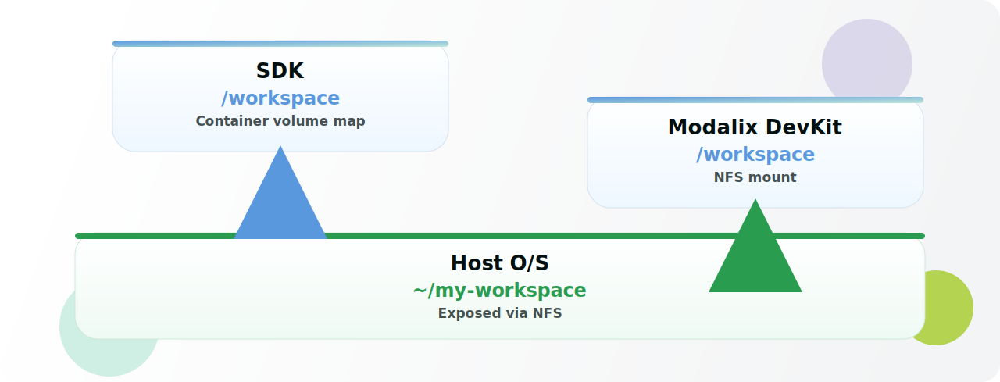

**Before pairing,** make sure the host and the Modalix DevKit can reach each other on the network — you should be able to `ping` the DevKit IP from the host. Confirm your board software first with `cat /etc/buildinfo`.

---

### 2.1 Single-step install (latest — recommended)

Reference: https://developer.sima.ai/software/getting-started/dev-environment/install-the-environment/

Install the current NEAT SDK 2.1 release channel. **Installation and DevKit pairing are a single flow** — the command downloads the SDK image and then automatically starts setup and prompts you to pair, taking the **DevKit IP inline** at the prompt:

```bash
sima-cli neat install sdk@release-2.1
```

`release-2.1` tracks the latest NEAT SDK patch release in the 2.1 series. The current release is **NEAT SDK 2.1.2.2**, which is compatible with **DevKit software 2.1.2**.

1. Run the command. It validates the release metadata and downloads the SDK image. The first install can take several minutes.

    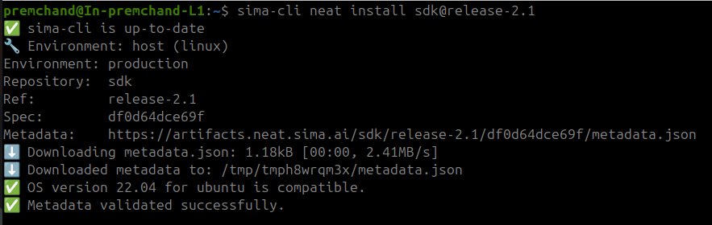

    ---

2. Once the image is available locally, setup starts automatically. At `Do you want to pair this SDK with a DevKit now? [y/N]`, press `y`, then enter the DevKit IP at `Enter DevKit IP address:` (for example, `<host-ip>`).

    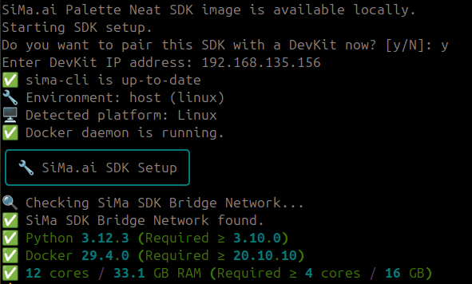

    ---

**Skip pairing:** *if you do not have the DevKit IP yet, press `N`. The SDK workspace is still created, and you can pair later with `sima-cli sdk setup` (then install the NEAT library on the DevKit — see https://developer.sima.ai/software/getting-started/neat-library/install-or-update).*

Setup then continues with the [standard setup prompts](#standard-setup-prompts) below.

---

### 2.2 Two-step install (previous — older SDK releases)

Reference: https://developer.sima.ai/software/reference/two-step-sdk-installation/

For SDK **2.0.0, 2.1.2.0, or 2.1.2.1**, install in two separate commands — first pull the SDK image, then run setup and pair.

1. **Pull the SDK image** that matches your board:

    ```bash
    sima-cli install ghcr:sima-neat/sdk:v2.1-latest   # or pin e.g. :v2.0.0 for a 2.0.0 board
    ```

    

    ---

2. **Run setup and pair** with the DevKit, passing the IP with `--devkit`:

    ```bash
    sima-cli sdk setup --devkit <devkit-ip>
    ```

    

    ---

Setup then continues with the same [standard setup prompts](#standard-setup-prompts) below.

---

### Standard setup prompts

After either install method above, setup walks through the same prompts. Your DevKit IP, workspace path, and container/image name will differ.

1. Review the **System Requirements Report**. If `Some system checks failed` appears only because of a `Firewall` `WARNING`, press `y` at `Do you want to continue anyway? [y/N]`.

    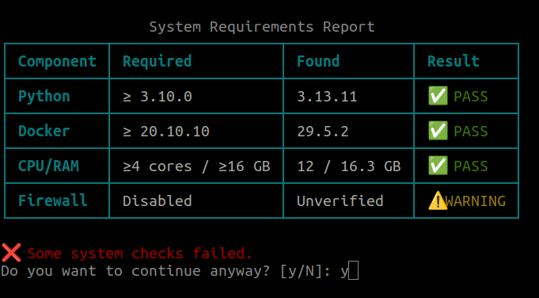

    ---

2. Select the SDK Docker image (the one you downloaded is pre-selected). Press `Enter` to confirm.

    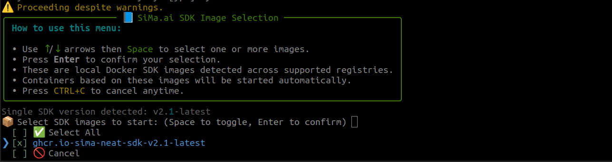

    ---

3. Select the default workspace, or enter a custom workspace path.

    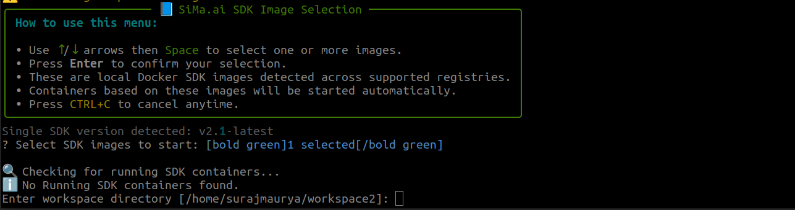

    ---

4. SDK extension: press `Enter`.

    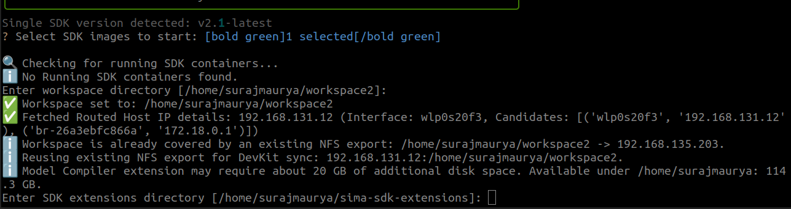

    ---

5. **Important for second and later runs:** press `n` to reuse the existing SDK container. If you press `y`, setup may create a new container and run the installation again. For a first-time install, follow the prompt to create the SDK container.

    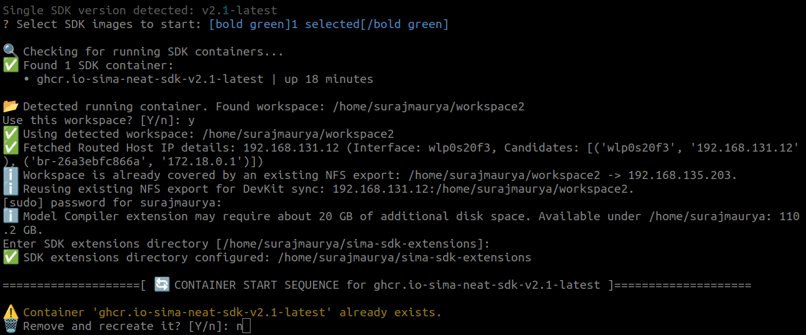

    ---

6. Install the Model Compiler extension only if needed. This is optional and may take about 15 minutes and around 10 GB of disk space.

    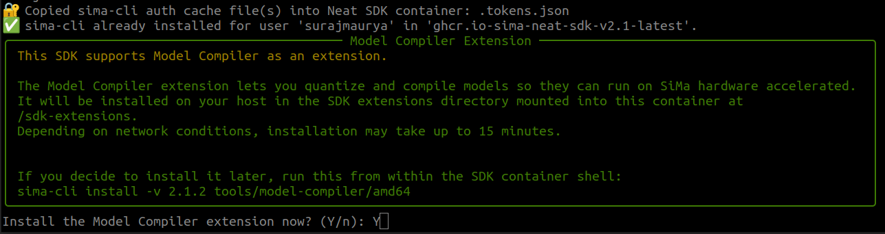

    ---

7. Select the workspace path for the Modalix DevKit. By default, setup uses `/workspace` on the board and mounts the host workspace folder there. Press `Enter` to accept the default. If it asks for a password, enter `edgeai`.

    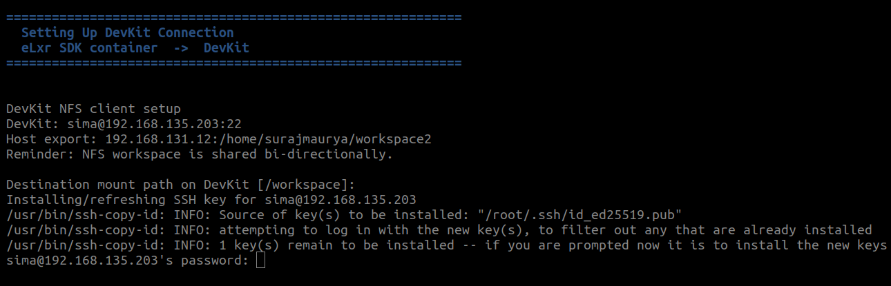

    ---

8. Confirm that the installation completed successfully.

    

    ---

**Repeat runs:** *You do not need to reinstall or re-pull the image. Re-run setup directly with `sima-cli sdk setup --devkit <devkit-ip>`, and press `n` at the container prompt to reuse the existing container.*

Reference:

- https://developer.sima.ai/software/getting-started/dev-environment/pair-with-a-devkit/
- https://developer.sima.ai/software/getting-started/compatibility/

---

## 3. (Optional) Install the Model Compiler

Install only if you need to compile ONNX/GenAI models for Modalix. Choose the correct architecture (amd64/arm64) and version that matches your board/SDK.

Example:

```bash
# amd64 example for v2.1.2
sima-cli install -v 2.1.2 tools/model-compiler/amd64
```

Reference: 
- https://developer.sima.ai/software/getting-started/compatibility#model-compiler
- https://developer.sima.ai/software/compile-a-model/

---

## 4. Open the SDK container in VS Code, then build and run

1. Install VS Code on the host machine:

   - Download: https://code.visualstudio.com/download
   - Ubuntu example:

    ```bash
    sudo apt update
    sudo snap install code --classic
    ```

2. Open VS Code and install these extensions:
   - **Dev Containers** by Microsoft

3. Attach VS Code to the running NEAT SDK container:

    - Open the VS Code Command Palette with `Ctrl+Shift+P`.
    - Select **Dev Containers: Attach to Running Container...**.

        

    - Select the downloaded and installed `sima-neat/sdk` container.

        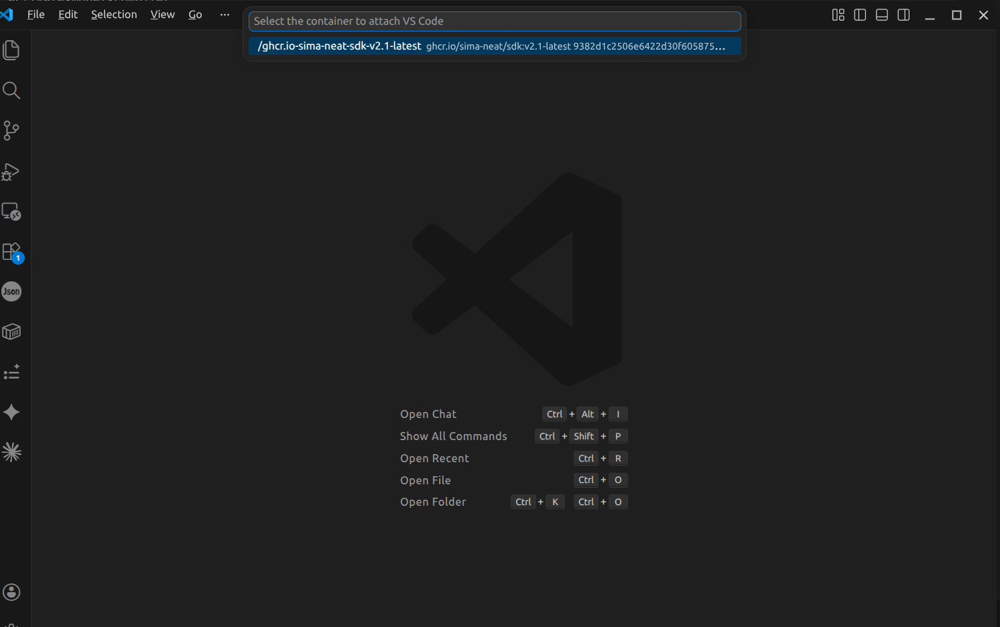

    - In the attached VS Code window, open the `/workspace` folder (or wherever you cloned this repo).

        

    - Install `Codex` or `Claude` VS Code extension for Agentic Mode of  Development. 

        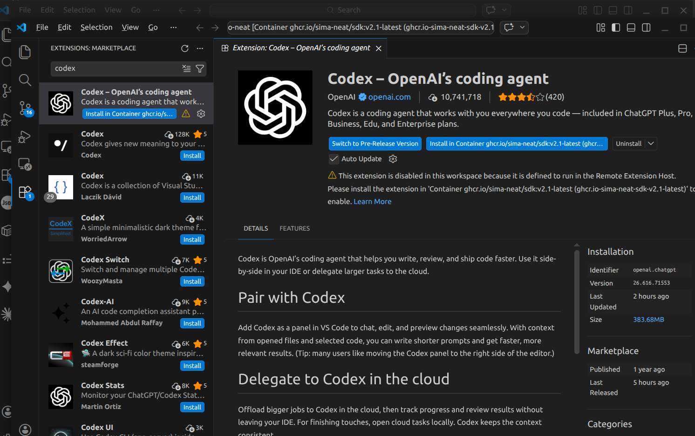

    - Check if sima-skill get picked by `Codex` / `Claude`.

        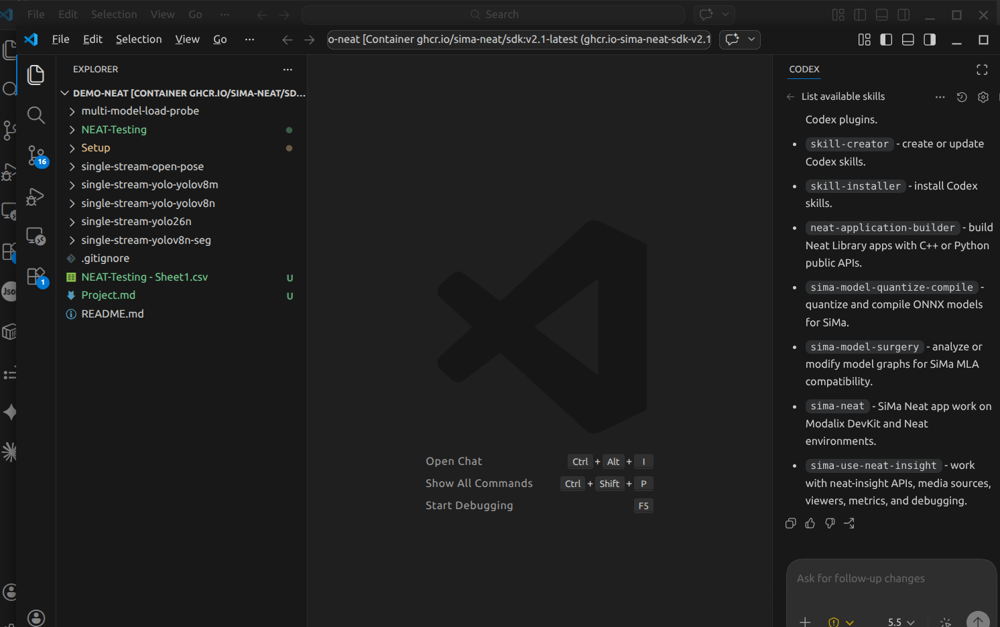

    - Done with the setup

4. From inside the attached SDK container, build your C++ app or prepare a PyNeat script in `/workspace`.

5. Use `dk` to execute on the paired DevKit:

```bash
# run a compiled C++ binary on devkit
dk build/<binary-name>

# run a PyNeat script on devkit
dk hello_neat.py
```

6. Minimal PyNeat smoke test (`hello_neat.py`):

```python
import neat
print("PyNeat import successful")
```

Run inside the SDK using `dk hello_neat.py` to confirm runtime availability on the Modalix DevKit.

Reference: https://developer.sima.ai/software/develop-apps/hello-neat/minimal/

---

## 5. Troubleshooting & tips

- If versions mismatch: confirm board with `cat /etc/buildinfo` and pin the SDK/model-compiler versions accordingly.
- Use the shared `/workspace` (set by pairing) to avoid manual file copies between host and DevKit.
- NEAT Insight: available at `https://localhost:9900` when running inside the SDK — use it to inspect streams, files, and runtime logs. See [neat_insight.md](neat_insight.md).
- For network pairing issues, ensure the DevKit and host are reachable on the same network and firewall rules allow the pairing flow.
- Primary reference: https://developer.sima.ai/software/getting-started/

---

## References

- https://developer.sima.ai/software/getting-started/
- https://developer.sima.ai/software/getting-started/dev-environment/
- https://developer.sima.ai/software/getting-started/dev-environment/install-the-environment/
- https://developer.sima.ai/software/compile-a-model/
- NEAT Insight guide: [neat_insight.md](neat_insight.md)
