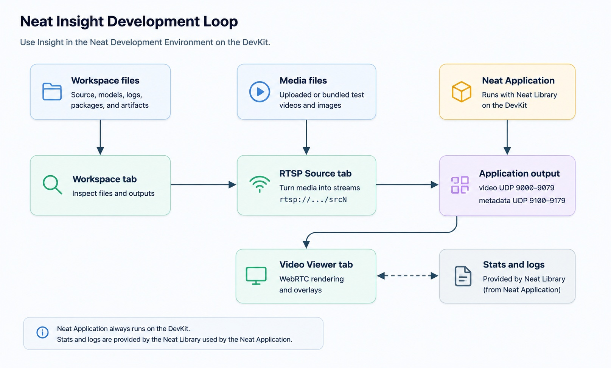
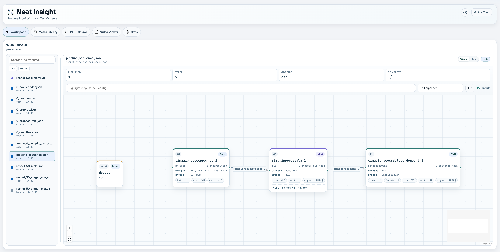
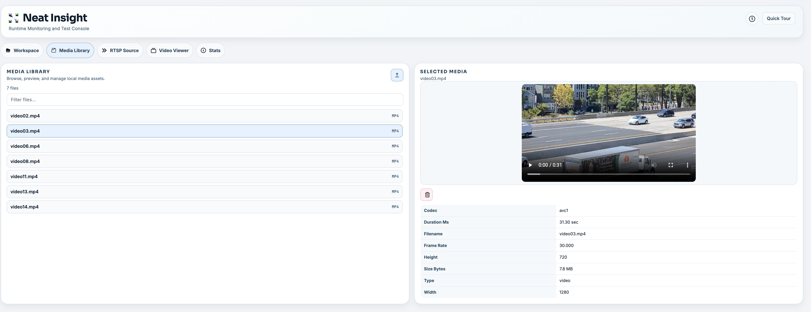
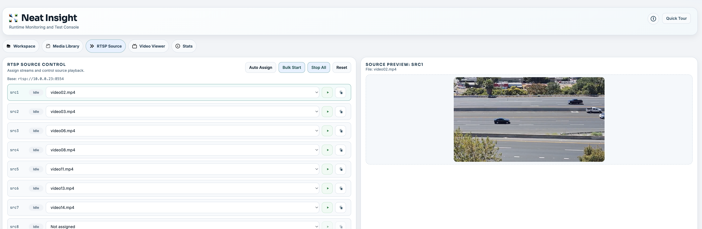
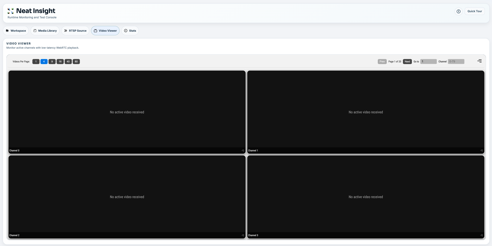

# NEAT Insight

Scope: concise, practical guide to NEAT Insight — what it is, how to access/install it, and how to create an RTSP stream from a clean browser-based UI.

Primary reference: https://developer.sima.ai/software/tools/insight/

---

**NEAT insight**

Run this on the host machine and you can check the insights on NEAT from a clean UI.

NEAT Insight is the browser-based inspection and test console for NEAT vision application development. Use it to verify output and isolate problems across the application, stream path, and device runtime layers.

## Table of Contents

- [1. Concepts](#1-concepts)
- [2. Access NEAT Insight](#2-access-neat-insight)
- [3. Install & upgrade](#3-install--upgrade)
  - [(Optional) Install on a DevKit](#optional-install-on-a-devkit)
  - [Upgrade](#upgrade)
- [4. Insight UI overview](#4-insight-ui-overview)
- [5. Create an RTSP stream using NEAT Insight](#5-create-an-rtsp-stream-using-neat-insight)
- [6. Tips](#6-tips)
- [References](#references)

---

## 1. Concepts

The typical Insight development loop:

upload media → convert to RTSP sources (e.g. `rtsp://127.0.0.1:8554/src1`) → run your application against those sources → view output through the WebRTC Video Viewer → analyze runtime metrics and logs.



Core functions:

- **Workspace inspection** — visualize generated model, package, and profiling artifacts.
- **Test media service** — upload media and convert it into streaming sources.
- **RTSP source generation** — turn media files into live streams.
- **WebRTC video rendering** — view application output with metadata overlays.
- **Runtime diagnostics and logging** — compare application behavior against runtime state.

Reference: https://developer.sima.ai/software/tools/insight/concepts

---

## 2. Access NEAT Insight

Open the Insight UI in a browser:

- **https://localhost:9900** — when browsing from the same machine where the SDK is running.
- **https://\<host-ip>\:9900** — when browsing from another machine on the network.

Before you start:

- Ensure the **NMS mount** is correctly present on the workspace.
- The paired **devkit-ip** is visible in the **top-right corner** of the UI.

Check that the service is running:

```bash
insight-admin status
```

The default web UI port is **9900**, but the SDK can allocate a different host port if `9900` is already in use. The `neat` command reports the actual URL and port mapping:

```bash
neat --json
```

Use `insight.webUiUrl` for the main UI, and the `exposedPorts` array when configuring DevKit applications, RTSP clients, or external media senders.

Reference: https://developer.sima.ai/software/tools/insight/

---

## 3. Install & upgrade

Insight is **bundled with the NEAT Development Environment**. When the SDK container starts with Insight enabled, it is installed, configured, and supervised automatically — it listens over HTTPS and the SDK publishes the host ports for the browser, DevKit, and other clients. No manual install is required; use Section 2 to open it.

### (Optional) Install on a DevKit

Install Insight directly on a Modalix DevKit only when you want the inspection console to run on the target device, or when validating a standalone DevKit setup.

```bash
# install a tagged release
sima-cli neat install insight@{release-tag}

# or install a development build (branch or tag)
sima-cli neat install insight@main

# activate the created virtual environment and start Insight
source ~/.simaai/neat-insight/venv/bin/activate
neat-insight --port 9900
```

Then open **https://\<devkit-ip>\:9900**. Applications on that DevKit can use the default local ports; clients outside the DevKit connect using the DevKit IP and that instance's exposed ports.

### Upgrade

Insight is a NEAT artifact, so upgrade it with the same install flow:

```bash
# a release
sima-cli neat install insight@{release-tag}

# the latest build from a branch
sima-cli neat install insight@main
```

In the NEAT Development Environment, Insight runs from `/opt/neat-insight/venv`. To upgrade the supervised SDK instance, install into that venv and restart the service (use elevated permissions if `/opt/neat-insight` requires them):

```bash
NEAT_INSIGHT_VENV_DIR=/opt/neat-insight/venv sima-cli neat install insight@main
supervisorctl restart neat-insight
```

Reference: https://developer.sima.ai/software/tools/insight/install-upgrade

---

## 4. Insight UI overview

The Insight interface is organized into five tabs:

- **Workspace:** Browse project files, search sources, inspect artifacts, and preview text/code/images, MLA stats, and pipeline sequences.
- **Media Library:** Upload, preview, inspect, and delete test media. Supports `mp4`, `mov`, `avi`, `mkv`, and `webm`.
- **RTSP Source:** Convert uploaded media into live streams mapped to three RTSP paths (`src1`, `src2`, `src3` on port `8554`).
- **Video Viewer:** Display WebRTC output (up to 80 channels) with metadata overlays for detection, classification, pose estimation, segmentation, and tracking.
- **Stats:** Placeholder for planned CPU, memory, disk, temperature, and profiling metrics.



---

## 5. Create an RTSP stream using NEAT Insight

1. Open **https://localhost:9900** (or **https://\<host-ip>\:9900**) in the host machine browser.

2. Navigate to **Media Library** and upload the media video. The view provides file selection, preview, metadata inspection, upload, and delete actions in one place.

    

3. Navigate to **RTSP Source**. Assign media files to source slots (`src1`, `src2`, `src3`) manually, or use **auto-assign** to distribute unique files across slots. Start an individual source, or bulk-start all streams.

    

4. Run your NEAT application / pipeline against the RTSP source(s).

5. After the pipeline runs, view the output in the **Video Viewer** tab to verify video/metadata arrival and overlay alignment.

    

Reference: https://developer.sima.ai/software/tools/insight/user-interface

---

## 6. Tips

- Always browse to Insight over **HTTPS** on port **9900**; accept the self-signed certificate warning if prompted.
- If the page does not load, confirm Insight is up with `insight-admin status` and re-check the port from `neat --json`.
- Confirm the **NMS mount** is present on the workspace and that the **devkit-ip** shows in the top-right corner before starting a stream.
- Refer to the official documentation for further details.

---

## References

- https://developer.sima.ai/software/tools/insight/
- https://developer.sima.ai/software/tools/insight/concepts
- https://developer.sima.ai/software/tools/insight/install-upgrade
- https://developer.sima.ai/software/tools/insight/user-interface
- https://developer.sima.ai/software/getting-started/
