# NEAT on Windows — Installation & Setup Guide

Scope: end-to-end steps to install and run Palette **NEAT** on a **Windows 11** laptop, from prerequisites through installing `sima-cli`, the NEAT SDK, and pairing with a Modalix DevKit.

Primary references:

- Install the environment: https://developer.sima.ai/software/getting-started/dev-environment/install-the-environment/
- Windows host setup (eLxr SDK): https://developer.sima.ai/software/reference/elxr-sdk-host-setup/windows
- sima-cli tool: https://developer.sima.ai/software/tools/sima-cli/

> This document is the **Windows-specific** companion.

---

## The short version (WSL-first)

On Windows, **all NEAT tooling runs inside WSL2 (Ubuntu), not in native PowerShell/Command Prompt.** Windows itself only provides WSL2, Docker, and the network path to the DevKit. This avoids Windows `PATH`/Python issues and matches the official Windows host-setup guide.

```text
Windows 11 (host)
│
├── WSL2  ──────────────────────────►  Ubuntu 22.04 / 24.04
│                                         ├── Docker (Engine via WSL integration)
│                                         ├── Python 3.12+  +  pip
│                                         ├── sima-cli
│                                         └── NEAT SDK / NEAT Core / PyNeat
│
├── Docker Desktop (WSL 2 engine)
│
└── Network path to ──────────────────►  Modalix DevKit
    (direct USB/Ethernet + ICS, or shared LAN)
```

---

## Component overview

What you are installing and how the pieces fit together — the same NEAT software stack as the platform-neutral guide ([README.md](README.md)), with the **Host** running inside WSL2 on Windows:

- **Host:** Your Windows 11 laptop — runs WSL2 (Ubuntu) with `sima-cli`, the container runtime, and your local workspace.
- **Modalix DevKit (Board):** Target hardware running Modalix firmware where applications execute.
- **NEAT SDK (cross-compile):** Containerized environment for building C++ apps, preparing model artifacts, and pairing with the board.
- **NEAT Core:** Runtime C++ libraries that power model execution and app APIs on Modalix.
- **PyNeat:** Python bindings/runtime for prototyping and running NEAT apps on the DevKit.
- **Model Compiler:** Optional toolchain to compile/quantize ONNX or GenAI models for Modalix.
- **NEAT Insight:** Browser-based inspection and debugging tool for runtime streams, files, and logs. See [neat_insight.md](neat_insight.md).
- **NEAT Apps:** User applications built with NEAT C++ or PyNeat deployed to the DevKit.


---

## Quick checklist (start here)

- [ ] Windows 11 host that meets the [hardware requirements](#1-prerequisites)
- [ ] WSL2 installed with Ubuntu 22.04 / 24.04 — [Step 2](#2-install-wsl2--ubuntu)
- [ ] WSL networking set to **mirrored** (needed for DevKit Sync) — [Step 3](#3-configure-wsl-networking)
- [ ] Docker working **inside Ubuntu** (`docker ps`) — [Step 4](#4-install-docker-with-wsl2-integration)
- [ ] Python 3.12+ and pip available **inside Ubuntu** — [Step 5](#5-verify-python-and-pip-inside-wsl)
- [ ] `sima-cli` installed **inside Ubuntu** and logged in — [Step 6](#6-install-sima-cli-inside-wsl) / [Step 7](#7-log-in-to-the-sima-developer-portal)
- [ ] NEAT SDK installed — [Step 8](#8-install-the-neat-sdk)
- [ ] DevKit reachable and paired — [Step 9](#9-pair-with-the-modalix-devkit)
- [ ] SDK container open in VS Code; build & run with `dk` — [Step 11](#11-open-the-sdk-in-vs-code-then-build-and-run)

---

## 1. Prerequisites

### 1.1 Hardware (host minimums)

| Resource         | Minimum                | Notes                                              |
| ---------------- | ---------------------- | -------------------------------------------------- |
| CPU              | 4 cores                |                                                    |
| RAM              | 16 GB                  | 128 GB recommended for **GenAI** model compilation |
| Free disk space  | 100 GB                 | 512 GB preferred for **GenAI** model compilation   |
| Privileges       | Administrator / `sudo` | Required on both Windows and inside Ubuntu         |

### 1.2 Operating system

- **Windows 11** (x86_64) with **WSL2**.
- Inside WSL: **Ubuntu 22.04 or 24.04**.

> Supported hosts overall: Ubuntu 22.04/24.04, **Windows 11 via WSL (x86_64)**, macOS 15.5+ (Apple Silicon). This guide covers Windows.

### 1.3 Confirm Windows version and resources

In **PowerShell** (or Command Prompt), verify the host against the requirements above:

```powershell
systeminfo
```

Check that **OS Name** is Windows 11, **System Type** is `x64-based PC`, and **Total Physical Memory** is at least 16 GB.

Reference: https://developer.sima.ai/software/getting-started/dev-environment/

---

## 2. Install WSL2 + Ubuntu

All commands in this step run in **PowerShell as Administrator**.

1. Check the current WSL state:

   ```powershell
   wsl --status
   wsl --list --verbose
   ```

   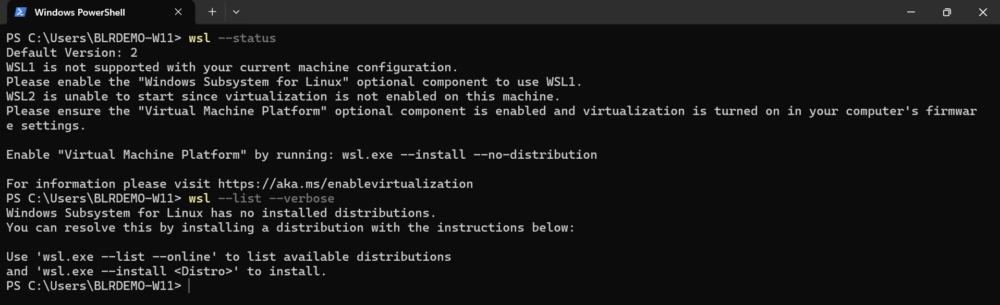

   If WSL reports `WSL2 is unable to start since virtualization is not enabled on this machine`, enable virtualization first:

   - Enable the **Virtual Machine Platform** Windows feature:

     ```powershell
     wsl.exe --install --no-distribution
     ```

   - If virtualization is still disabled, turn on **Intel VT-x / AMD-V** in the BIOS/UEFI firmware, then reboot. See https://aka.ms/enablevirtualization.

2. List the available distributions and install a supported Ubuntu LTS:

   ```powershell
   wsl --list --online
   wsl --install -d Ubuntu-24.04
   ```

   > `wsl --install -d Ubuntu` installs the newest Ubuntu, which may be a non-LTS release. Pin **Ubuntu-22.04** or **Ubuntu-24.04** for a supported host.

3. **Reboot Windows.** After installing the distribution, WSL prints `Changes will not be effective until the system is rebooted.`

4. After the reboot, launch **Ubuntu** from the Start menu and create your Linux username and password when prompted.

5. Confirm WSL2 and the Ubuntu version **inside the Ubuntu terminal**:

   ```bash
   uname -a            # should mention: microsoft-standard-WSL2
   cat /etc/os-release # should show Ubuntu 22.04 or 24.04
   ```

---

## 3. Configure WSL networking

NEAT **DevKit Sync** (the shared `/workspace` mapping) needs the host and DevKit to reach each other over the network. On Windows, set WSL to **mirrored** networking so the DevKit can see the WSL environment. This lets WSL share the host network configuration, which both **DevKit Sync** and **NFS communication** rely on.

1. In Windows, edit (or create) the file `%UserProfile%\.wslconfig` and add:

   ```ini
   [wsl2]
   networkingMode=mirrored
   ```

2. Apply the change by shutting WSL down from PowerShell:

   ```powershell
   wsl --shutdown
   ```

3. Reopen Ubuntu.

Reference: https://developer.sima.ai/software/reference/elxr-sdk-host-setup/windows

---

## 4. Install Docker (with WSL2 integration)

NEAT runs the SDK as a Docker container. On Windows, the simplest path is **Docker Desktop** using the WSL 2 engine.

### 4.1 If `docker --version` fails inside Ubuntu

```bash
docker --version
# 'docker' is not recognized / command not found  → Docker Desktop is not installed (or not integrated)
```

Install **Docker Desktop for Windows**, and during installation ensure **"Use WSL 2 based engine"** is enabled. Then:

```powershell
wsl --shutdown
```

Reopen Ubuntu and re-test (see 4.3).

### 4.2 If `docker --version` works in PowerShell but not in Ubuntu

Docker Desktop exists, but WSL integration is disabled. Open **Docker Desktop → Settings → Resources → WSL integration**. Enable **"Enable integration with my default WSL distro"**, turn on the toggle for your **Ubuntu** distro under *Enable integration with additional distros*, then click **Apply**.

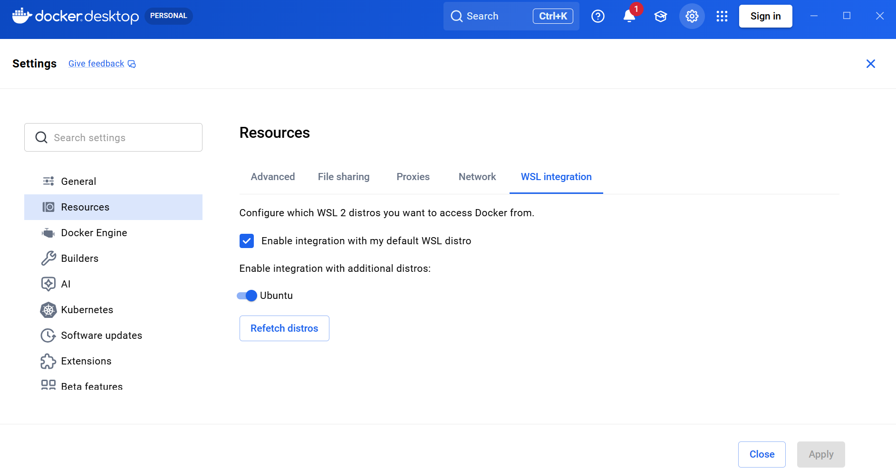

### 4.3 Verify Docker inside Ubuntu

```bash
docker --version   # e.g. Docker version 28.x.x
docker ps          # should list containers (empty is fine), no permission error
```

> **Permission denied on `/var/run/docker.sock`?** Your user must be in the `docker` group, and the **current shell** must pick up that membership.
>
> ```bash
> sudo usermod -aG docker $USER   # add user to the docker group (skip if already a member)
> newgrp docker                   # apply the group membership in the current shell
> docker ps                       # should now work without sudo
> ```
>
> On newer Ubuntu, `newgrp` may be missing (`Command 'newgrp' not found`). Install it, then retry:
>
> ```bash
> sudo apt install util-linux-extra
> newgrp docker
> ```
>
> Confirm membership with `groups` (you should see `docker`). Logging out and back in has the same effect as `newgrp docker`.

---

## 5. Verify Python and pip inside WSL

`sima-cli` needs **Python 3.12 or newer** with `pip` and `venv`, **inside Ubuntu**.

```bash
python3 --version   # should be >= 3.12
pip3 --version
```

If `pip`/`venv` are missing:

```bash
sudo apt update
sudo apt install -y python3-pip python3-venv
```

> **Do not** rely on Python installed on the Windows side. The native Windows `sima-cli` installer commonly fails with `Python was not found` even when Python is installed on Windows, due to `PATH` and virtual-environment issues. Use the Python inside Ubuntu.

---

## 6. Install sima-cli inside WSL

Run the **Linux** installer inside the Ubuntu terminal (not PowerShell):

```bash
curl -fsSL https://artifacts.neat.sima.ai/sima-cli/linux-mac.sh | bash
```

Verify:

```bash
sima-cli --version
```

> Windows note: a native PowerShell installer exists
> (`Invoke-WebRequest -Uri "https://artifacts.neat.sima.ai/sima-cli/windows.bat" -OutFile "windows.bat"` then `.\windows.bat`),
> but it depends on a correctly configured Windows Python/`PATH`. On a standard-user laptop it typically fails — `Python was not found` repeats even when Python is installed on Windows, because of App-execution-alias/`PATH` and virtual-environment issues:
>
> 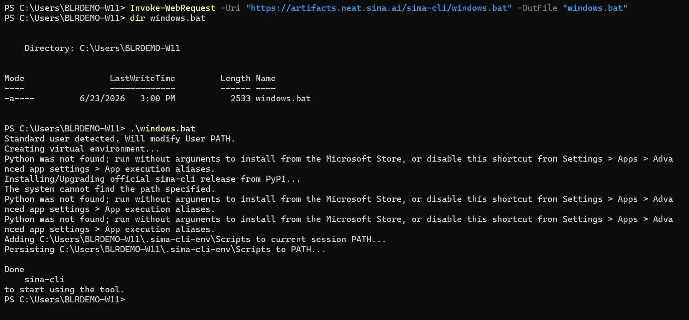
>
> The supported and reliable path on Windows is to install `sima-cli` **inside WSL**, as shown above.

Reference: https://developer.sima.ai/software/tools/sima-cli/

---

## 7. Log in to the SiMa Developer Portal

```bash
sima-cli login
```

Authenticate with your **SiMa Developer Portal** credentials when prompted.

---

## 8. Install the NEAT SDK

Install the current NEAT SDK 2.1 release channel. From the **Ubuntu terminal**, this **single command** downloads the SDK container image and then automatically starts SDK setup, including the DevKit pairing prompt covered in [Step 9](#9-pair-with-the-modalix-devkit):

```bash
sima-cli neat install sdk@release-2.1
```

`release-2.1` tracks the latest NEAT SDK patch release in the 2.1 series. The current release is **NEAT SDK 2.1.2.2**, which is compatible with **DevKit software 2.1.2**. Confirm your board software first with `cat /etc/buildinfo` on the DevKit.

> **If this fails with a Docker permission error** — `Docker daemon is running, but this user lacks permission to access it` (cannot access `/var/run/docker.sock`) — your shell has not picked up `docker` group membership yet. `sima-cli` prints the exact fix: run `newgrp docker` (or log out and back in), then re-run the install:
>
> ```bash
> newgrp docker
> sima-cli neat install sdk@release-2.1
> ```
>
> If `newgrp` itself is missing (`Command 'newgrp' not found`, common on newer Ubuntu), install it first, then retry:
>
> ```bash
> sudo apt install util-linux-extra
> newgrp docker
> sima-cli neat install sdk@release-2.1
> ```
>
> 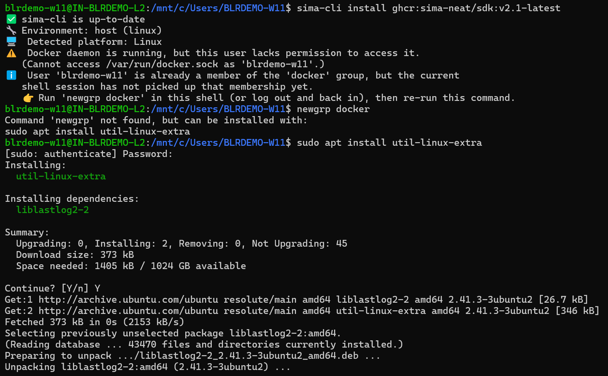
>
> See [Step 4.3](#43-verify-docker-inside-ubuntu) for the underlying `docker` group setup.

On success, `sima-cli` confirms the Docker daemon and starts pulling the image:

```text
✓ Docker daemon is running
Pulling container image ...
```

The initial download can take several minutes and may show no progress bar. After the image is downloaded, setup runs automatically and asks whether to pair with a DevKit — continue with [Step 9](#9-pair-with-the-modalix-devkit). If you skip pairing, the SDK workspace is still created and you can pair later.

> **Windows ordering note.** Pairing needs the DevKit reachable, which on Windows depends on the [ICS networking](#91-connect-the-devkit-windows-networking) and [NFS firewall](#92-allow-nfs-traffic-through-the-windows-firewall) setup in Step 9. Either complete Step 9.1–9.2 **before** running this install command, or press `N` at the pairing prompt to skip pairing and pair afterward with `sima-cli sdk setup --devkit <devkit-ip>`.

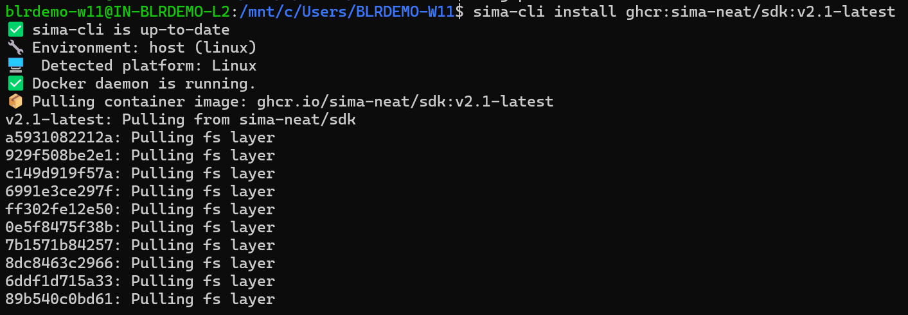

> **Older SDK releases (legacy two-step install).** For SDK **2.0.0, 2.1.2.0, or 2.1.2.1**, use the legacy image-pull + setup flow instead — pull the image that matches your board, then run setup separately:
>
> ```bash
> sima-cli install ghcr:sima-neat/sdk:v2.0.0   # match the tag to your board
> sima-cli sdk setup --devkit <devkit-ip>
> ```

References:

- https://developer.sima.ai/software/getting-started/dev-environment/install-the-environment#install
- https://developer.sima.ai/software/getting-started/compatibility/

---

## 9. Pair with the Modalix DevKit


### 9.1 Connect the DevKit (Windows networking)

On Windows, the recommended setup is a **direct USB/Ethernet connection** between the laptop and the DevKit, using **Internet Connection Sharing (ICS)** so the DevKit also gets internet:

1. Connect the Windows laptop to the internet via Wi-Fi (or another upstream interface).
2. Connect the DevKit to the laptop via a USB-to-Ethernet adapter / Ethernet.
3. Keep the DevKit's network interface on **DHCP**.
4. Open network connections: `Win + R` → `ncpa.cpl` (or *Control Panel → Network and Internet → Network Connections*).
5. Right-click the **internet-facing** adapter → **Properties** → **Sharing** tab.
6. Enable **"Allow other network users to connect through this computer's Internet connection."**
7. In **Home networking connection**, select the **USB/Ethernet** adapter going to the DevKit.
8. **Apply** (reconnect the adapter if needed).

The shared adapter is typically assigned an address on the `192.168.137.0/24` subnet; the DevKit gets an address in that range.

### 9.2 Allow NFS traffic through the Windows firewall

DevKit Sync uses NFS for the shared workspace. In **PowerShell (Administrator)**:

```powershell
New-NetFirewallRule -DisplayName "Allow NFS TCP 2049" -Direction Inbound -Protocol TCP -LocalPort 2049 -Action Allow
New-NetFirewallRule -DisplayName "Allow NFS UDP 2049" -Direction Inbound -Protocol UDP -LocalPort 2049 -Action Allow
```

Confirm the DevKit is reachable from WSL (replace with your DevKit IP):

```bash
ping <devkit-ip>
ssh sima@<devkit-ip>   # optional connectivity check
```

### 9.3 Run guided setup

The `sima-cli neat install sdk@release-2.1` command in [Step 8](#8-install-the-neat-sdk) starts this guided setup automatically once the image is downloaded. It asks whether you want to pair with a DevKit and takes the **DevKit IP inline** at the prompt — you do not pass it as a flag:

```text
Do you want to pair this SDK with a DevKit now? [y/N]: y
Enter DevKit IP address: 192.168.135.156
```

Run the commands below directly only when you need to re-run setup later (for example, to re-pair or restart the container). From the Ubuntu terminal, if you know the DevKit IP:

```bash
sima-cli sdk setup --devkit <devkit-ip>
```

If you do not have the DevKit IP yet, press `N` at the pairing prompt (or run `sima-cli sdk setup` without a flag) to skip pairing — the workspace is still created and you can pair later.

Walk through the prompts (your DevKit IP, workspace path, and container name will differ):

1. At `Do you want to pair this SDK with a DevKit now? [y/N]`, press `y`, then enter the DevKit IP at `Enter DevKit IP address:`.

   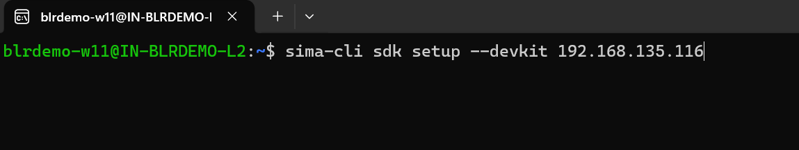

2. **System requirements check.** Setup verifies Python, Docker, and CPU/RAM (all should `PASS`). **Firewall** often shows a `WARNING` because it cannot verify the Windows firewall from inside WSL — that is expected once you have added the NFS rules in [Step 9.2](#92-allow-nfs-traffic-through-the-windows-firewall). At `Do you want to continue anyway? [y/N]`, press `y`.

   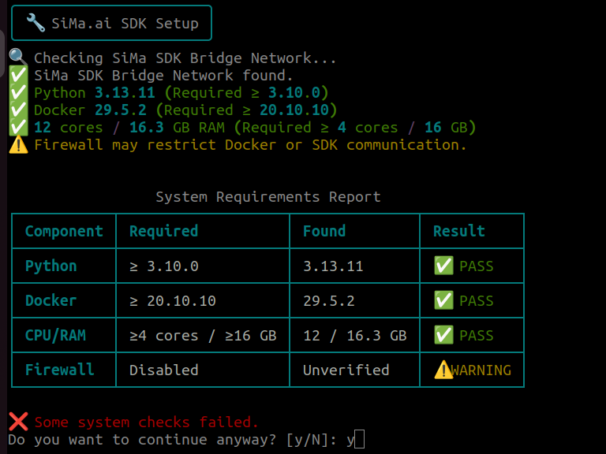

3. **Select the SDK image.** The detected image (e.g. `ghcr.io-sima-neat-sdk-v2.1-latest`) is already marked `[x]`. Use `Space` to toggle if needed, then press `Enter` to confirm.

   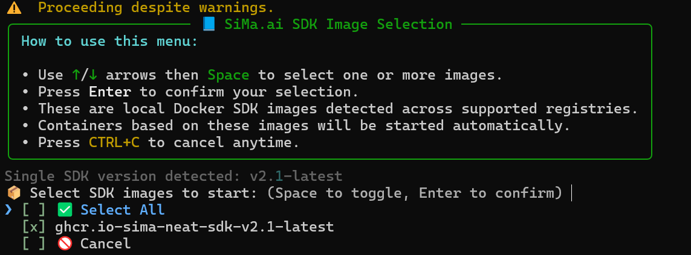

4. **Confirm the workspace.** Setup detects the running container's workspace (e.g. `/home/<user>/workspace`). At `Use this workspace? [Y/n]`, press `Y`, or enter a custom path.

   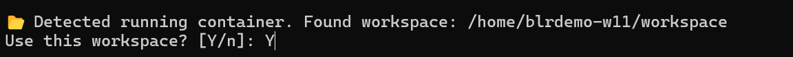

5. **SDK extensions directory.** Setup reports the routed host IP and reuses the existing NFS export for DevKit sync. At `Enter SDK extensions directory [/home/<user>/sima-sdk-extensions]`, press `Enter` to accept the default.

   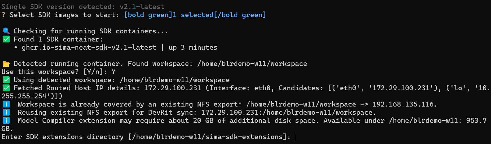

6. **Container start sequence.** If the SDK container already exists, setup asks `Remove and recreate it? [Y/n]`. For **second and later runs**, press `n` to reuse the existing container. For a **first-time** setup (or to rebuild), press `Y`.

   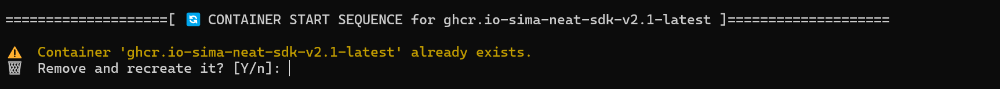

7. **DevKit connection.** Setup copies user accounts into the container, configures the DevKit NFS client, and shares `/workspace` bi-directionally. At `Destination mount path on DevKit [/workspace]`, press `Enter` to accept the default. Pairing is complete.

   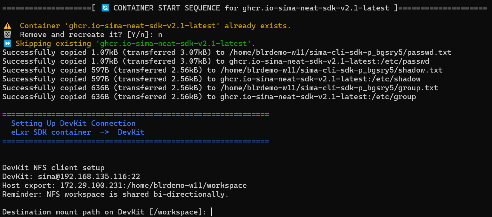

Open the SDK shell at any time with:

```bash
sima-cli sdk neat
```

References:

- https://developer.sima.ai/software/getting-started/dev-environment/pair-with-a-devkit/
- https://developer.sima.ai/software/reference/elxr-sdk-host-setup/windows

---

## 10. (Optional) Install the Model Compiler

Install only if you need to compile/quantize ONNX or GenAI models for Modalix.

### 10.1 Check your processor architecture

Pick the build that matches your CPU — `amd64` (Intel/AMD) or `arm64`.

**Command Prompt :** Press the **Windows key**, type `cmd`, and press **Enter**. Then run:

```bat
echo %PROCESSOR_ARCHITECTURE%
```

- `AMD64` → use **amd64**
- `ARM64` → use **arm64**

(Equivalently, inside the Ubuntu terminal `uname -m` prints `x86_64` for amd64 or `aarch64` for arm64.)

### 10.2 Install for your architecture

From the Ubuntu terminal, run the build that matches your architecture (version `2.1.2` shown — match it to your board/SDK):

```bash
# amd64
sima-cli install -v 2.1.2 tools/model-compiler/amd64

# or arm64
sima-cli install -v 2.1.2 tools/model-compiler/arm64
```

### 10.3 Authorize the device login

The installer needs a one-time device login. It tries to open a browser, but in WSL the auto-open usually fails with `gio: ... : Operation not supported`. **Copy the printed `https://auth.sima.ai/activate?user_code=XXXX-XXXX` link into a browser on Windows, sign in, and return to the terminal** — `sima-cli` continues automatically once authorized.

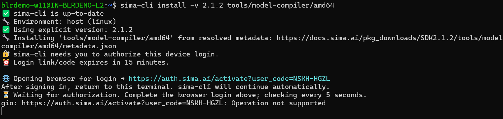

After you sign in, the terminal greets you and downloads the package (~180 MB download, ~9 GB installed):

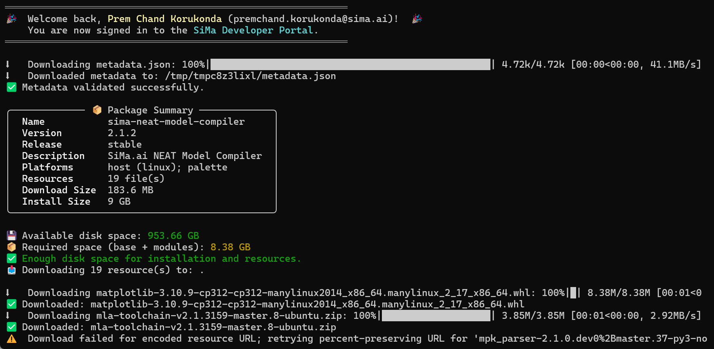

### 10.4 If it reports missing system packages

If the installer stops with `Missing required system packages` and `Installation failed with return code: 1`, it prints the exact command to fix it. **Run the recommended command, then rerun the installer:**

```bash
sudo apt-get update && sudo apt-get install -y cmake libbz2-dev libffi-dev libllvm18 liblzma-dev libopenblas0-pthread libreadline-dev libsqlite3-dev libssl-dev tk-dev
sima-cli install -v 2.1.2 tools/model-compiler/amd64   # rerun for your architecture
```

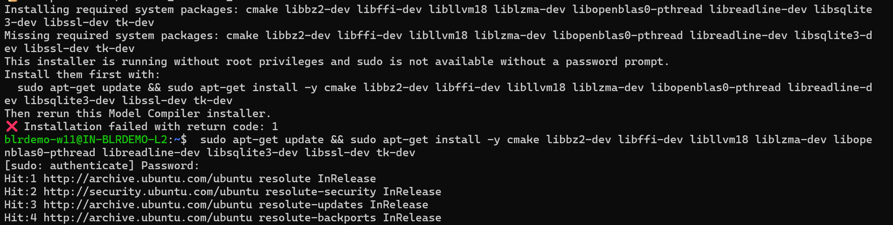

> Copy the package list from your own terminal output rather than relying on this snippet — it can change between SDK versions.

### 10.5 Activate

```bash
activate-model-compiler
```

Reference: https://developer.sima.ai/software/compile-a-model/

---

## 11. Open the SDK in VS Code, then build and run

1. Install **VS Code** on Windows: https://code.visualstudio.com/download

2. Install these VS Code extensions:

   - **WSL** by Microsoft (required on Windows to work across the WSL2 boundary)
   - **Dev Containers** by Microsoft
   - **Codex** extension
   - **Claude** extension

   Close and reopen VS Code so the extensions load cleanly.

3. Attach VS Code to the running NEAT SDK container:

   - Open the Command Palette with `Ctrl+Shift+P`.
   - Select **Dev Containers: Attach to Running Container...**.
   - Select the `sima-neat/sdk` container.
   - In the attached window, open the `/workspace` folder.

   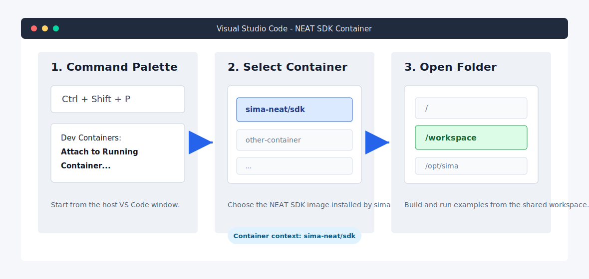

4. From inside the attached SDK container, build your C++ app or prepare a PyNeat script in `/workspace`.

5. Use `dk` to execute on the paired DevKit:

   ```bash
   # run a compiled C++ binary on the devkit
   dk build/<binary-name>

   # run a PyNeat script on the devkit
   dk hello_neat.py
   ```

6. Minimal PyNeat smoke test (`hello_neat.py`):

   ```python
   import neat
   print("PyNeat import successful")
   ```

   Run it with `dk hello_neat.py` to confirm runtime availability on the Modalix DevKit.

Reference: https://developer.sima.ai/software/develop-apps/hello-neat/minimal/

---

## 12. Troubleshooting (Windows-specific)

| Symptom                                            | Likely cause / fix                                                                                              |
| -------------------------------------------------- | -------------------------------------------------------------------------------------------------------------- |
| `WSL2 is unable to start ... virtualization is not enabled` | Enable **Virtual Machine Platform** (`wsl.exe --install --no-distribution`) and turn on VT-x/AMD-V in BIOS/UEFI, then reboot ([Step 2](#2-install-wsl2--ubuntu)). |
| `docker: command not found` in Ubuntu              | Docker Desktop not installed, or WSL integration off → [Step 4](#4-install-docker-with-wsl2-integration).        |
| `docker` works in PowerShell but not Ubuntu        | Enable Ubuntu under Docker Desktop → Resources → WSL integration, then Apply.                                    |
| `permission denied ... /var/run/docker.sock`       | Add user to the docker group, then refresh the shell: `sudo usermod -aG docker $USER` then `newgrp docker`.      |
| `Command 'newgrp' not found`                       | Install it on newer Ubuntu: `sudo apt install util-linux-extra`, then `newgrp docker`.                          |
| `Python was not found` from Windows installer      | Don't use the PowerShell installer. Install `sima-cli` inside WSL with the Linux script ([Step 6](#6-install-sima-cli-inside-wsl)). |
| `sima-cli` not found after install                 | Reopen the Ubuntu terminal so `PATH` refreshes; re-run `sima-cli --version`.                                     |
| DevKit not reachable / sync fails                  | Set `networkingMode=mirrored` ([Step 3](#3-configure-wsl-networking)), open NFS firewall ports, confirm `ping <devkit-ip>`. |
| Version mismatch (SDK vs board)                    | Check the board with `cat /etc/buildinfo` and pin the SDK/model-compiler version accordingly.                   |

Tips:

- Use the shared `/workspace` (set by pairing) instead of copying files between host and DevKit.
- **NEAT Insight** runs inside the SDK for inspecting streams, files, and logs. On a Windows direct-link (ICS) setup, open it **locally** at `https://localhost:9900` — firewall and WSL port-forwarding constraints prevent reaching it remotely from other machines on the network. See [neat_insight.md](neat_insight.md).

---

## References

- https://developer.sima.ai/software/getting-started/dev-environment/install-the-environment/
- https://developer.sima.ai/software/reference/elxr-sdk-host-setup/windows
- https://developer.sima.ai/software/tools/sima-cli/
- https://developer.sima.ai/software/getting-started/dev-environment/
- https://developer.sima.ai/software/getting-started/compatibility/
- Platform-neutral setup: [README.md](README.md)
- NEAT Insight guide: [neat_insight.md](neat_insight.md)